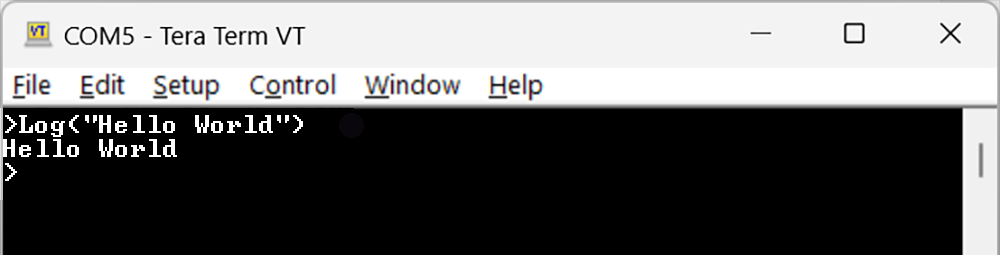

# DUE Script
---

The DUE Link platform includes a scripting language called DUE Script it runs internally on any [DUE-enabled hardware](../../hardware/intro.md). This allows the device to run standalone independent from any host. This very easy-to-learn scripting language is inspired by BASIC and Python, giving the user the simplicity and flexibility they need.

The on-line [DUE Console](../../software/console.md) lets developers start experimenting with DUE Script and the physical world in minutes...no installation is necessary!

## Operating Modes

DUE Script has two modes *Immediate mode* and *Record mode*. *Immediate mode* commands are executed immediately. *Immediate mode* commands are a single line of code. *Record mode* commands are stored in flash and then can be executed. The [DUE Console](../../software/console.md) handles these modes automatically. The following details are only needed when not using DUE Console, like when using a terminal software like TeraTerm.

**Immediate Mode**

The `>` command is used to switch the system to immediate mode. This in turn will change the prompt to `>` as well. All statements are executed as soon as entered.

```basic 
> Print("Hello World")
```




> [!NOTE]
> Immediate Mode is the default mode when device is first connected.

**Record Mode**
The *Record mode*, is entered using the `$` command. This will also modify the prompt to `$`. All statements entered are stored internally and not executed. The `run` command can be used to execute the program. The device will also automatically `run` a program on power up. 


|Statement              |Description                                                            |
|:----------------------|:----------------------------------------------------------------------|
|$                      |Sets the device in record mode                                      |
|>                      |Exits record mode and returns to direct mode                                    |

The following statements control the program recorded in flash, but can be used in both *Immediate or Record modes*. When used in *Record mode* these special statements execute, but are not added to the program in flash. 

|Statement              |Description                                                            |
|:----------------------|:----------------------------------------------------------------------|
|Run                    |Executes the program stored in flash                                     |
|New                    |Erases the program stored in flash                                    |
|List                   |Returns all the code in your program                                     |

> [!TIP]
> A running program can be terminated by hitting the ESC key, DEL Key, or Backspace Key. 

```basic 
> $
$ PrintLn (x)
$ PrintLn (y)
$ >
> x=1:y=2
> Run
1
2
>List
PrintLn(x)
PrintLn(y)
>new
```

> [!NOTE]
> The [DUE Console](../console.md) hides the prompts and automatically switches to the appropriate mode.


---
## Script Features
DUE Scripts are not case sensitive. Its syntax is very simple and inspired by BASIC coding language. The power of DUE Scripts comes from its simplicity rather than from its feature set. This is a perfect language to teach someone coding.

Users that require serious coding should be using the DUE Platform combined with one of the many available coding languages. Still, DUE Scripts can be used to extend those languages, as detailed below.

### Print 
`Print()` is a function that returns the value of its arguments. These arguments can be variables, strings, or equations. `Print()` is also unique because it can handle multiple arguments. 

```basic
x=100
Print(x)
Print("Hello World")
Print(x+x)
Print(x,"Hello World", x+x)
```
Result:
```
100Hello World200100Hello World 200
```

`PrintLn()` adds a line break to each print statement. 

```basic
x=100
PrintLn(x)
PrintLn("Hello World")
PrintLn(x+x)
PrintLn(x,"Hello World", x+x)
```
Result:
```
100
Hello World
200
100Hello World200
```

### Comments
The `#` character is used to identify a comment. Comments are ignored by the program, text added to help developers understand the code.

```basic
# This is a comment
x=10
Print(x) # This is also a comment 
```

### Variables
DUE Script has a fixed set of 26 variables, one for each letter, assigned to `a` to `z`. The only data type used in DUE is float. All variables created are global in nature. To use a variable, simply use `x=5.5` 

### Operands
DUE Script supports the following operators. 

**Mathematical** | 
---         | ---                       |   
\+          | Add                       |   
\-          | Subtract                  | 
\*          | Multiply                  | 
\/          | Divide                    |
%           | Modulus, the remainder    | 
**Comparators** | 
\>          | Greater Than              
\<          | Less Than                  
\>=         | Greater Than or Equal To   
\<=         | Less Than or Equal To      
\=          | Equal                      
!=          | Not Equal                  
**Logical** | 
\&&         | And 
\|\|        | Or
**Bitwise** |                         
\&          | Bitwise And               
\|          | Bitwise Or                 
\<<         | Shift Right       
\>>         | Shift Left        


### Arrays
Similarly to variables, arrays are fixed to 26 arrays. They are assigned to letters `a` to `z`. DUE Script differentiates between variable `a` and array `a[]` when square brackets are used. Arrays are size zero by default and can be sized, or resized using `Dim`.

This is an example that uses both, variables and arrays:

```basic
Dim a[10]
For i=0 to 9:a[i]=i*2:Next
For i=0 to 9:PrintLn(a[i]):Next
```

The output will look like:

```
0
2
4
6
8
10
12
14
16
18
```

> [!TIP]
> Use `Dim a[0]` to free up the memory reserved for array `a[]`.


### For-Loop
The For-Loop has two different syntax styles. **BASIC** and **Python** style. 

**BASIC Style**

The BASIC style For-Loop includes the last number in the range. 

```basic 
# Counting Up
For i=1 to 5
Print(i,",")
Next
```

Output:

`0,1,2,3,4,5,`


```basic
# Counting Up in increments of 10
For i=1000 to 1 Step 10
PrintLn(i)
Next

# Counting Down in increments of 10
For i=1000 to 1 Step -10
PrintLn(i)
Next
```

**Python Style**

DUE Script also allows For Loops written similar to Python. The last number of the range is not included in output.  

```basic
# Range with only stop value
For i in range(5)
Print(i,",")
next
```
Output:

`0,1,2,3,4,`


```basic
# Range with start and stop value
For i in range(1,5)
Print(i,",")
next

# Range with start, stop, and step value
For i in range(1,5,2)
Print(i,",")
next

# Range with start, stop, and negative step value
For i in range(10,1,-2)
Print(i,",")
next
```

### If-Statement
If-Statements must end with the `End` command. This will only end the If-Statement and not your program. 

```basic 
If x=1
PrintLn("one")
Else 
PrintLn("not one")
End
```

If-Statements can also be nested within each other. Each If-Statement requires an `End` command to terminate its own process. 

```basic
If x=1
  PrintLn("one")
Else
  If x =2
    PrintLn("two")
  Else
  PrintLn("not one or two")
  End
End
```


### Labels

Labels are needed to redirect the program. They are used by `Goto` and when calling a subroutine.

A Label is created by using the `@` symbol in front of the desired label. Labels are limited to 6 characters. 

### Goto

`Goto` is useful for repeating tasks indefinitely by sending to a specific *Label* name. 

```basic
@Loop
# add code here that runs forever
Goto Loop 
```

### Exit & Return

`Exit` terminates the program.

```basic
Print("Hello")
Exit
Print("This will not get printed")
```

`Return` send the execution back from a called subroutine, see Subroutines below.

### Subroutine

Developers can use Labels to create their own subroutines to implement "soft" like functions in their code. These subroutines are similar to functions but do not take variables or return values. 

> [!Tip] 
> The built-in API offers true functions and therefore do take arguments and return values.

User subroutines are always added in recoding mode and resides in nonvolatile memory. A user subroutine starts with a label and ends with a `Return`. 

```basic
@Mine
# add code here
Return
```

The subroutine can then be called by its name followed by `()`.

```basic
Mine()
```

 Note how a subroutine can be called externally from *Immediate Mode*. This allows for extending DUE Scripts with new commands that can then later be called from *Immediate Mode* and in turn be called from a high level language, like Python, when connected to a Host.

> [!TIP]
> DUE variables are global and any changes inside subroutines will affect variable values outside those subroutines.

---

## Combining Commands
Multiple commands can be combined on a single line. This is especially useful when using *Immediate mode* where a single line is required. To use multiple command, a `:` symbol is used.

This is an example of a for loop in a single line

```basic 
For i=1 to 1000 Step 10:PrintLn(i):Next
```
## Good Practices

Recorded DUE Scripts are executed immediately on power up (the run command is issued internally). If the user doesn't want any of the code to run, they can start the program with an `Exit` statement. And then the 'Exit' can be flowed by a label, for example '@Go'.

This code can be saved to the device using Record Mode:

```basic
Exit
@Go
Print("Only when Go!")
```

The program will not execute on power up due to the `Exit` command. But now calling `Go()` in immediate mode will produce "Only when Go!".

Another good practice is to use the on-board LED as an activity LED to show that the device is running. Simply start your program by adding `Led(200,200,-1)`.
