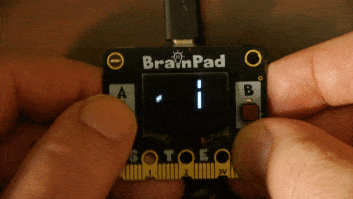

# Falling Bird Game

In this example we create 2 different versions of the same game one using a NeoPixel Matrix, and other using the BrainPad Pulse and its on-board screen.

---

## NeoPixel Falling Bird


This sample creates a simple falling bird type game using a [NeoPixel matrix](neopixel-matrix.md). The object is for the player to move to avoid random obstacles. 

**Hardware:**
- Any device supporting DUE-Script. In this case we're using the BrainPad Pulse with its built-in **A** button.
- NeoPixel 16x16 Matrix with zig-zag matrix configuration

```basic
w=16      # Width of the matrix 
u=4       # Player X position
v=8       # Player Y position
t=0       # Player tail Y offset
b=15      # Wall X position
h=4       # Wall height
g=6       # Wall gap
BtnEnable('a', 1)
# Game loop
@loop
  NeoClear()
  plyr()
  wall()
  coll()
  NeoShow(256)
  wait(50)
goto loop
# Handle the player
@plyr
  if BtnDown('a')
    if v>0:v=v-1:end
    t=1
  else
    if v<15:v=v+0.5:end
    t=-1
  end
  x=u
  y=trunc(v)
  pxl()
  NeoSet(p, 64,0,64)
  x=x-1
  y=y+t
  pxl()
  NeoSet(p, 64,0,64)
return
# Update wall
@wall
  b=b-0.25
  if b<=0
    b=15
    g=4+rnd(2)
    h=2+rnd(6)
  end
  for i=0 to 1
    x=trunc(b)+i
    for y=0 to h
      pxl()
      NeoSet(p, 0,64,0)
    next
    for y=h+g to 15
      pxl()
      NeoSet(p, 0,64,0)
    next
  next
return
# Check collision
@coll
  i=trunc(b)
  if i != u && i != u-1 :return:end
  if v<=h:goto die:end
  if v>=h+g:goto die:end
return
# Player died
@die
  for i=0 to 20
    x=(u-2)+rnd(4)
    y=(v-2)+rnd(4)
    pxl()
    NeoSet(p, rnd(64),0,0)
    NeoShow(256)
  next
  b=15
return
# Formula for index into 16x16 NeoPixel Matrix
# p=pxl(x,y)
@pxl
  p = x*w+(x&1)*(w-1)+(1-2*(x&1))*y
return
```

# Pulse Falling Bird




This sample creates a falling bird game just like the NeoPixel version [NeoPixel version](falling-bird.md)  of the game. The object is for the player to move to avoid random obstacles.
Hardware:
- Brainpad Pulse

```basic
u=4       # Player X position
v=8       # Player Y position
t=0       # Player tail Y offset
b=31      # Wall X position
h=4       # Wall height
g=6       # Wall gap
BtnEnable('a', 1)
# Game loop
@loop
  LcdClear(0)
  plyr()
  wall()
  coll()
  LcdShow()
goto loop
# Handle the player
@plyr
  if BtnDown('a')
    if v>0:v=v-1:end
    t=1
  else
    if v<15:v=v+0.5:end
    t=-1
  end
  x=u
  y=trunc(v)
  pxl()
  x=x-1
  y=y+t
  pxl()
return
# Update wall
@wall
  b=b-0.5
  if b<=0
    b=31
    g=4+rnd(2)
    h=2+rnd(6)
  end
  x=trunc(b)
  for y=0 to h
    pxl()      
  next
  for y=h+g to 15
    pxl()
  next
return
# Check collision
@coll
  i=trunc(b)
  if i != u:return:end
  if v<=h:goto die:end
  if v>=h+g:goto die:end
return
# Player died
@die
  for i=0 to 20
    x=(u-2)+rnd(4)
    y=(v-2)+rnd(4)
    pxl()
    LcdShow()
  next
  b=31
return
# Plot large pixel
# p=pxl(x,y)
@pxl
  #for i=0 to 2: for j=0 to 3:LcdPixel(1, x*4+j, y*3+i):next:next
  LcdPixel(1, x*4, y*3)
  LcdPixel(1, x*4+1, y*3)
  LcdPixel(1, x*4+2, y*3)
  LcdPixel(1, x*4+3, y*3)
  LcdPixel(1, x*4, y*3+1)
  LcdPixel(1, x*4+1, y*3+1)
  LcdPixel(1, x*4+2, y*3+1)
  LcdPixel(1, x*4+3, y*3+1)
  LcdPixel(1, x*4, y*3+2)
  LcdPixel(1, x*4+1, y*3+2)
  LcdPixel(1, x*4+2, y*3+2)
  LcdPixel(1, x*4+3, y*3+2)
return
```