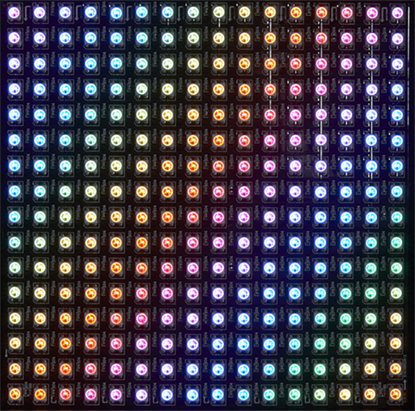
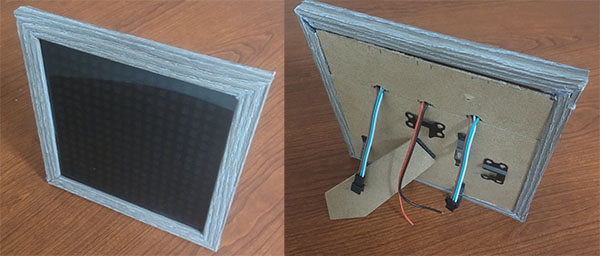
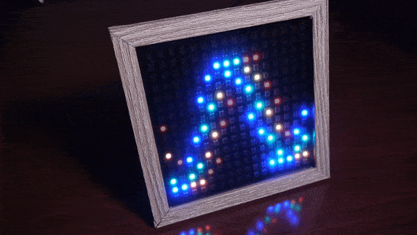

# NeoPixel 16x16 Matrix

---

These samples uses [NeoPixel](../corelib/neopixel.md). NeoPixel is an addressable LED that actually contains 3 LEDs, RED, GREEN, and BLUE. These three LEDs combine to make just about any color. NeoPixel come in many different configurations, from 1 single NeoPixel to panels containing many. DUE allows for up to 256 NeoPixel. This is perfect for a 16x16 setup. 



**Hardware:**
- Any device supporting DUE-Script
- NeoPixel 16x16 Matrix with zig-zag matrix configuration

**Set-up:**

- Connecting the panel is easy, we just need to connect three wires POWER, GND, and DATA to control all the LEDs. On the back of most NEOPixel panels are 3 sets of cables connected to the panel. 


**OUT:** connector is used to connect panels together. 

**POWER:** is used to connect 5V external power source to the panel. This is often necessary when using many LEDs. 

**IN:** connector is where we connect our hardware to the NeoPixel. We connect PIN 1 DUE enabled hardware to the wire labeled DIN, in this case the wire is the green wire. 

**Add a picture frame:**

We took 2 5x7" picture frames and connected the longer ends together to make a picture frame to hold our NeoPixel. We even used the back of the picture frames as a built-in stand. 



---

## Sine wave


This sample shows a sine wave scrolling along the matrix


```basic
# NeoPixel - Moving sine wave
h=16:w=16
z=3.1415926/6
i=0
@loop
  NeoClear()
  for x=0 to 15
    y = 8+sin((x+i)*z)*6
    pxl()
    NeoSet(p,0,128,0)
  next
  NeoShow(256)
  i=i+1
goto loop

# Formula for index into 16x16 NeoPixel Matrix
# p=pxl(x,y)
@pxl
  p = x*w+(x&1)*(w-1)+(1-2*(x&1))*y
  return
```

---

## Colorful sine wave



This sample shows a colorful sine wave scrolling along the matrix

```basic
# NeoPixel - Colorful Moving sine wave
h=16:w=16
i=0
z=3.1415926/6
@loop
  NeoClear()
  for x=0 to 15
    d = x+i
    y = 8+sin(d*z)*6
    pxl()
    NeoSet(p,128,0,0)

    y = 8+sin((d+1)*z)*6
    pxl()
    NeoSet(p,0,128,0)

    y = 8+sin((d+2)*z)*6
    pxl()
    NeoSet(p,0,0,128)
  next
  NeoShow(256)
  i=i+1
goto loop

# Formula for index into 16x16 NeoPixel Matrix
# p=pxl(x,y)
@pxl
  p = x*w+(x&1)*(w-1)+(1-2*(x&1))*y
  return
```

---

## Rainbow


This sample shows a colorful rainbow


```basic
# NeoPixel - Rainbow
h=16:w=16
z=3.1415926/15
NeoClear()
for x=0 to 15 
  for i=4 to 8
    y = i+sin(x*z)*6
    pxl()
    if i%5=0:NeoSet(p,0,0,128):end
    if i%5=1:NeoSet(p,0,128,0):end
    if i%5=2:NeoSet(p,0,128,128):end
    if i%5=3:NeoSet(p,128,0,0):end
    if i%5=4:NeoSet(p,128,0,128):end
  next
next
neoshow(256)
exit

# Formula for index into 16x16 NeoPixel Matrix
# p=pxl(x,y)
@pxl
  p = x*w+(x&1)*(w-1)+(1-2*(x&1))*y
  return
```
