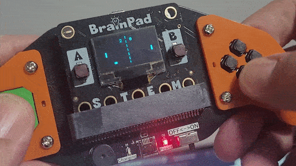

# BrainGamer - Sketch



Pair your Pulse with the Brain Gamer to create the first game ever Pong!

Hardware:
- Brainpad Pulse
- BrainGamer


```basic
#BrainGamer Pong
@Start
a = 30 #Left Player Position
b = 30 #Right Player Position
g = 10 #Ball x
h = 2.3 #Ball x direction
i = 10 #Ball y
j = 2.6 #Ball y direction
s = 0 #Player1 Score
t = 0 #Player2 Score
w = 0 #Check Win

@Loop
    LcdClear(0)   
    g = g + h #Move Ball X
    i = i + j #Move Ball Y
    
    if i < 5 || i> 55: #Bounce off top or bottom walls
        j = j* -1
    End
    
    LcdFill(1, g, i, 4, 4) #Draw Ball
    
    if g > 118:
       if i >= (b - 1) && i <= (b + 12)
          #Add code here when player hits ball
          h = h* -1
          Sound(256,100,50)
       else
          #Add code here when player misses
          s = s + 1
          g = 15
          Von()#Vibrate BrainGamer
          Wait(100)
          Voff()#Turn off Vibrate
       End
    End

    if g < 12:
       if i >= (a - 1) && i <= (a + 12)
          #Add code here when player hits ball
          h = h* -1
          Sound(256,100,50) 
       else
          #Add code here when player misses
          t=t+1
          g=115
          Von()#Vibrate BrainGamer
          Wait(100)
          Voff()#Turn off Vibrate
       End
    End
    
    Rocker() #Check Rocker Move
    if y < 40:a = a - 4:End #Move Left Paddle Up
    if y > 60:a = a + 4:End #Move Left Paddle Down
    if a < 5:a = 5:End #Left Paddle Hits Top
    if a > 50:a = 50:End #Left Paddle Hits Bottom
    
    LcdFill(1, 10, a, 2, 10) #Draw Left Paddle
    
    Keys() #Check Key Press
    if u = 0:b = b - 4:End #Move Right Paddle Up
    if d = 0:b = b + 4:End #Move Right Paddle Down
    if b < 5:b = 5:End #Right Paddle Hits Top
    if b > 50:b = 50:End #Right Paddle Hits Bottom
     
    LcdFill(1,120,b,2,10) #Draw Right Paddle
    
    For n = 0 to 64 step 10 #Draw Net
        LcdLine(1,64,n,64,n+5)
    Next   
    
    if s = 5
       LcdClear(0)
       LcdTextS("Player 1",1,5,0,2,2)
       LcdTextS("WINS!",1,25,20,2,2)
       LcdShow()
       w=1
       Wait(3000)
    End

    if t = 5
       LcdClear(0)
         LcdTextS("Player 2",1,5,0,2,2)
       LcdTextS("WINS!",1,25,20,2,2)
       LcdShow()
       w=1
       Wait(3000)
    End

    if w = 1 #If winner play sound and restart      
       Sound(256,1000,50) 
       Sound(200,1000,50)
       Sound(256,1000,50)  
       Wait(1500)
       Goto Start()
    End
   
    LcdText(str(s),1, 50, 5);
    LcdText(str(t),1, 74, 5);
    LcdShow()
    
   Wait(10)
Goto Loop

Exit
#####################################
###       BrainGamer Driver       ###
#####################################
###   variables used by driver    ###
###         x,y,u,d,l,r           ###
#####################################        

### Rocker ###
# Reads the rocker position into x and y
@Rocker
x = ARead(4)
y = ARead(3)
Return

### Activate Vibrator ###
@Von
DWrite(8,0)
Return

### Deactivate Vibrator ###
@Voff
DWrite(8,1)
Return

### Read Keypad ####
# Reads the 4 buttons into U,D,L,R
@Keys
u = DRead(14,1)
d = DRead(15,1)
l = DRead(13,1)
r = DRead(16,1)
Return
return
```
