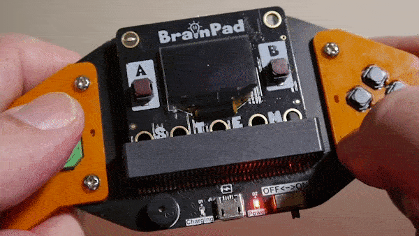

# BrainGamer - Sketch



Pair your Pulse with the Brain Gamer to create a piece of art

Hardware:
- Brainpad Pulse
- BrainGamer

This example demonstrates the use of both digital and analog inputs. 

|        | Pin#          |
| :--- |:---|
| Rocker X | 4 |
| Rocker Y | 5 |
| Up | 14 |
| Down| 15 |
| Left | 13 |
| Right | 16 |

```basic
# BrainGamer - Sketch
init()

@loop
  # Gamer Btn-X - Clear the image
  if dread(13, 1)=0 
    init()
  end

  # Draw the pixel
  LCDPixel(1,x,y)
  LCDShow()

  # Read the joystick
  u=aread(4) # Joystick-X
  v=aread(3) # Joystick-Y
  
  # Move the pen based on the joystick position
  if u<45:x=x+1:end
  if u>55:x=x-1:end
  if v<45:y=y-1:end
  if v>55:y=y+1:end

  # Wrap around the screen edges
  if x>127:x=0:end
  if x<0:x=127:end
  if y>63:y=0:end
  if y<0:y=63:end
goto loop

# Initialize the scetcher
@init
  x=64
  y=32
  LCDClear(0)
return
```
