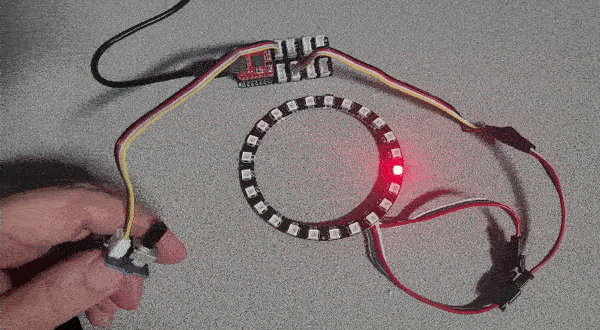

# Rotary NeoPixel

---

This sample uses a Grove rotary module to control NeoPixel Ring. This sample use [Analog](../corelib/analog.md) & [Neopixel](../corelib/neopixel.md).



**Hardware:**
 - FEZ Flea
- Grove XIAO Shield
- Grove Rotary Angle Sensor
- NeoPixel Ring

**Software:**

```basic
@loop
NeoClear()
NeoShow(24)
a=ARead(6)
NeoSet(a/4,255,0,0)
NeoShow(24)
Wait(50)
goto loop
```
