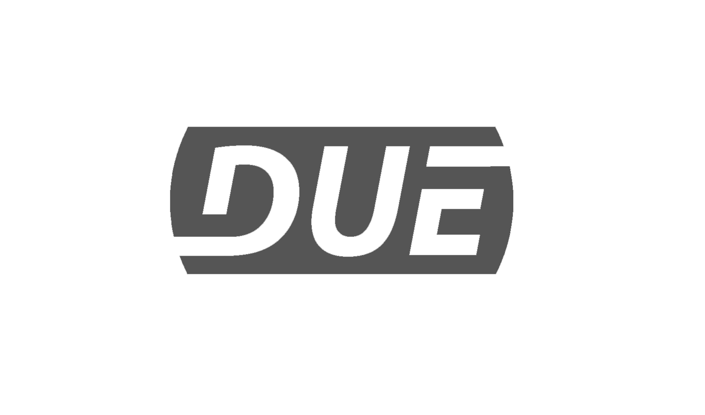

# DUE Scripting Language
---



It can be accessed from any modern OS and any language/system that have access to serial ports.


See the [downloads](downloads.md) page for currently supported languages.

## Why DUE?
DUE stands for Dynamic, Universal and Extensible. A user-friendly scripting language that allows for internal real-time processing. 

### Dynamic
Arguably, DUE script is the most user-friendly programming language out there!


## Comments
Comments are ignored text added to help developers read code.

```
// This is a comment
print x // This is also a comment 
```

## Understanding Environment

The `ScriptEngine` takes a script and compiles it and then it will run any top level statements. Any functions and variables are loaded in the environment, and will still be there even when execution has completed.

This script `Foo(x)` will raise an error. There is no `Foo` function and no variable `x` in the script.

Now this script is ran:

```
x=5
@Foo(s)
	print s
end
```

While the earlier script will not do anything, it actually loads the environment with a variable and a function.

Running the first script now works fine `Foo(x)`.

---

## Samples

### Recursion

```
func factorial(n)
    if n == 0 return 1 end
    return n * factorial(n - 1)
end

print(factorial(5))
```

### if

```
func ToWords(i)
    if i < 10
        return i + " units"
    elseif i < 100
        return i + " tens"
    elseif i < 1000
        return i + " hundreds"
    else
        return i + " thousands"
    end
end

print(ToWords(3))
print(ToWords(55))
print(ToWords(432))
print(ToWords(2342))
```

### while

```
var i = 1
while i <= 10
    print(i)
    i = i + 1
end
```


