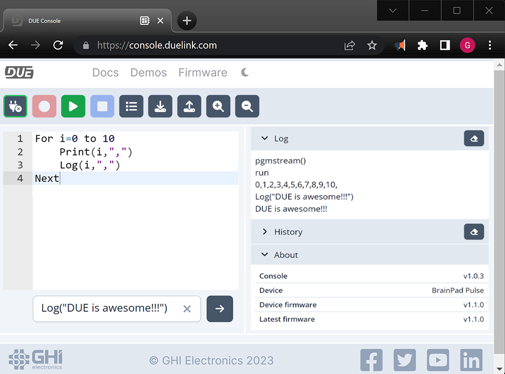

# Getting Started

---

<div style="text-align: center;">


</div>

## Hardware Selection

The first step is to pick from one of the many available [DUE Hardware](../hardware/intro.md) options. Which includes the Maker friendly FEZ (Fast & Easy) boards and the STEM educational BrainPad boards.

If you're just starting out with DUE Link, the BrainPad hardware and its included lessons are recommended.


Follow the hardware instructions to load the latest DUE Link firmware onto your device.

## Start Coding

If using BrainPad, visit its website for full lessons on DUE Link and other hosted languages, like Python and JavaScript.

<div style="text-align: center;">

[](../hardware/brainpad.md)

</div>

---

## Blink LED

Assuming you already have hardware and the board is loaded with the latest firmware, We will start by blinking an LED using DUE Script.

Open the [DUE Console](https://console.duelink.com/)




Reset your hardware, or simply unplug it from the PC and then plug it back in. Now, we can connect to the DUE console. To connect click on the Plug button.


A window will now show the available connections. If you have more than one, select the one that has DUE in it and click **Connect**.


Note how the “About” panel shows some important info, and may remind you that you do not have the latest firmware.


For our blinky program, we do not need to write any code! Just click on Demos ➤ Blink LED.


We can now Record (red button) 


and then Play (Green Button). The LED will now start blinking on your board.


What you just did was write a program in “Recording Mode”. This program lives on the board (gets recorded) and will always be executed on the device on power up, or after reset. Go ahead and Click Stop (Blue button).


Go to the immediate window, where it says “Code to Run Immediately…” and enter:
```
Log(“Hello DUE”)
```


And then click the execute button (Right Arrow). This will now show Hello DUE in the Output panel. This line of code was not recorded onto the device and only got executed. More on recorded vs immediate modes in future lessons.


---

## Coding Options


The DUE Link ecosystem includes many coding options, starting with DUE Link we have just used. 


<div style="text-align: center;">

[](../software/coding-options/coding-options.md)

</div>
