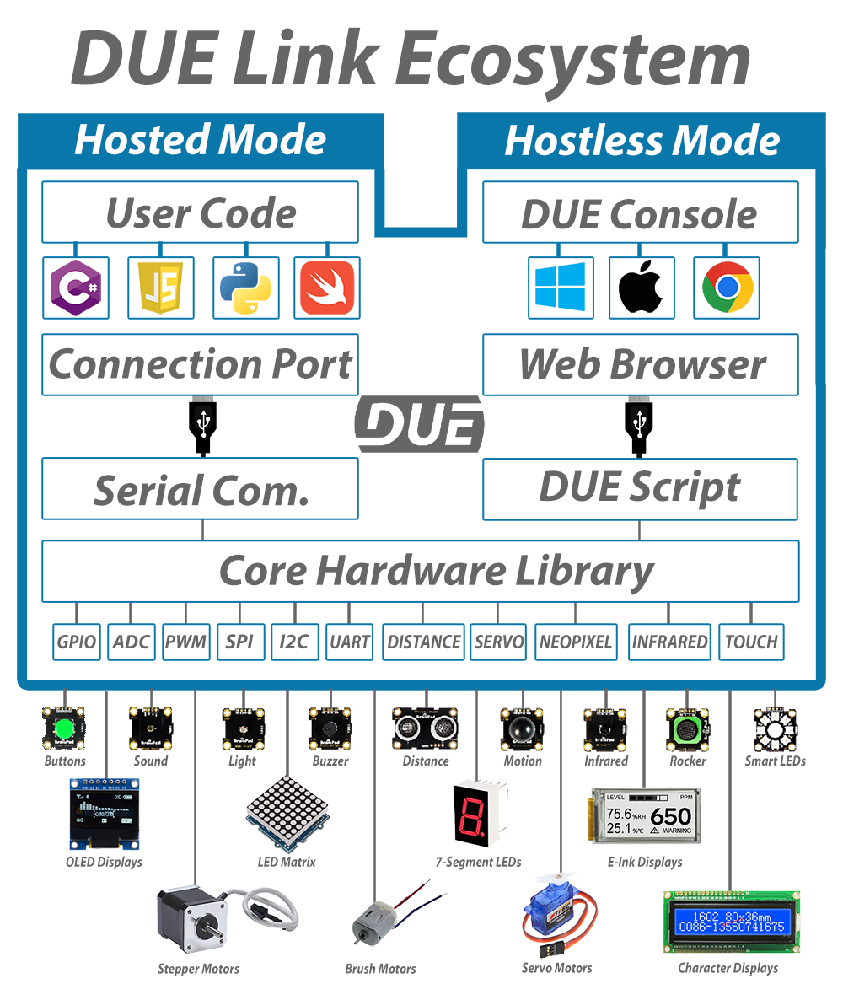

# DUE Link

---

A DUE Link enabled device can give a computer, tablet or phone access to the physical world. Not only that, the DUE platform includes [DUE Script](due-script/due-script.md) for extending the device's features or even run independently from any additional hardware.

## Host Mode

 Though a standard USB connection, a DUE-enabled device can be connected to modern devices, such as phones, laptops, tablets, desktops and even smaller devices such as Raspberry Pi. The device will simply load, with no need to load any USB drivers. This is true on Windows, Mac, Linux, Android and even Chrome OS.

Once effortlessly connected, developers can use the [coding environment](coding-options/coding-options.md) of choice to access a long list of available inputs and outputs. This includes, but not limited to, Analog, Digital, PWM, I2C, and SPI.

Several coding languages are officially supported , with provided libraries and sample code; however, any other language can theoretically be supported using our open-source [DUE libraries](https://github.com/ghi-electronics/due-libraries).

See all of the [Coding Options](coding-options/coding-options.md).

## DUE Scripts

The DUE Link platform includes DUE Scripts allowing for further expandability. Additionally, these scripts allow the system to run independently from any host.

Learn more about [DUE Script](due-script/due-script.md).

