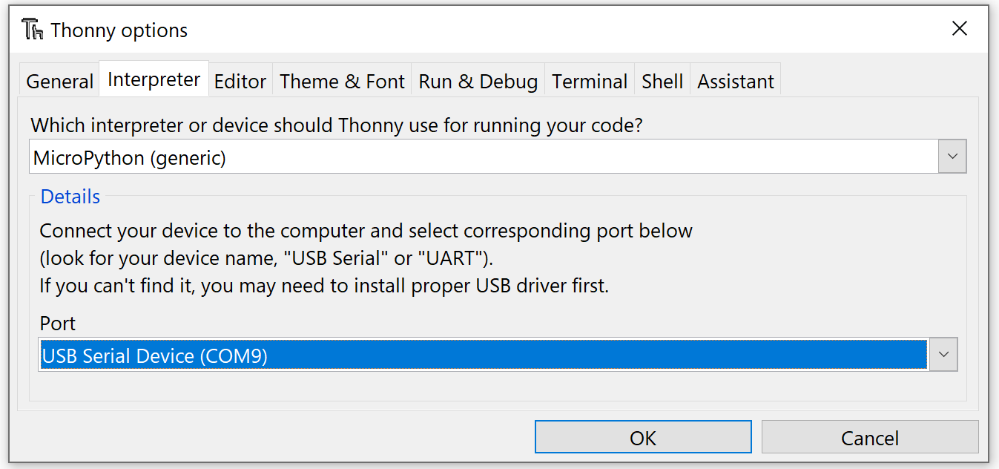
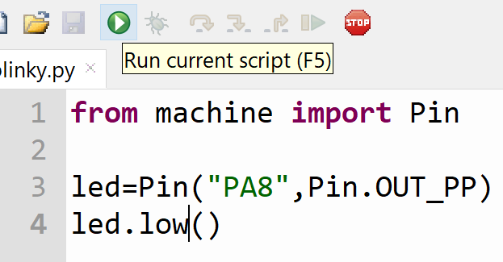
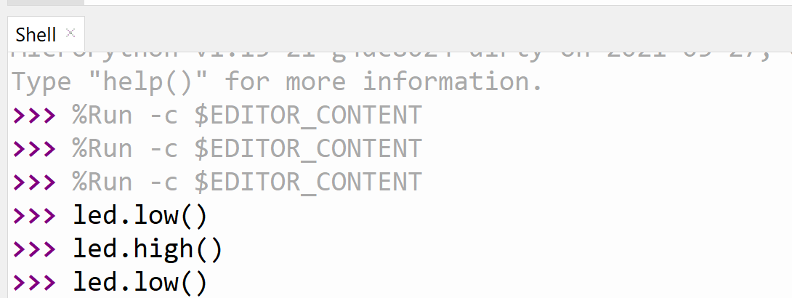

# Editors

---

While it is possible to simply use MicvroPython on SITCore with zero installation, adding an editor would make for a better user experience.

There are many available options but this page will highlight https://www.thonny.org/

#Thonny


This an a lean Python editor that is easy to install and use. It works for full Python development but it is as useful for MicroPython.

We first need to visit https://www.thonny.org/ and download the version compatible with the OS being used. In our example here, we are using Windows.

The editor is now ready to edit and run full Python programs. To use Thonny with SITCore, we first need to plug in the SITCore device, such as FEZ Flea, and load it with MicroPython firmware as detailed in [Getting Started](getting-started.md). Then from the top menu `Run->Select Interpreter...`


We need the `MicroPython (generic)` option and on the 'Port' drop down we need to select the REPL COM port.



We will add a new file with the following code and save it.

```py
from machine import Pin

led=Pin("PA8",Pin.OUT_PP)
led.high()
```

> [!Tip]
> PA8 on SITCore SC13048 is activity LED and found on all boards. This LED can be used by the user as well.

We can now click the run icon or hit F5. This will send the script to the device and the LED will come on.



The shell window is the REPL interface, showing any error messages. It is also useful for entering code. `led.low()` will turn the LED off.



We will test an infinite loop.

```py
from machine import Pin
import time

led=Pin("PA8",Pin.OUT_PP)

while True:
    led.low()
    time.sleep(0.3)
    led.high()
    time.sleep(0.3)
```
To stop the running program, we can use ctrl+C (stop) or ctrl+D (soft reset). Or we can click the stop icon.
