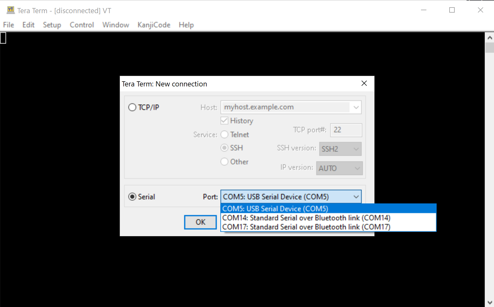

# Getting Started

---


This page explains how to load and use MicroPython on the GHI Electronics supported devices.

---

## The Terminal Software

Tera Term is the recommended terminal software but any other software should work. Tera Term is free and widely used. Download Tera Term from the [downloads](downloads.md) page or directly or search the web for downloads.

Unzip the downloaded file and run `ttermpro.exe`. The software will look like the image below.


Go ahead and click cancel on this page.

The next step is to put the device in `Loader` mode. This is accomplished by setting LDR pin low during reset or power up. On devices that have LDR button, just hold the LDR button down and continue to hold it down while reseting the board and then release the LDR button. This step will bring the device into loader mode, which will load a new virtual serial port. On windows, the `Device Manager` will look something like the image below.


Go back to Tera Term and, from the top menu, select `File->New connection...`. A new window will pop-up with serial ports updated with the COM port we have introduced in previous step. Select that new port and click OK.



Hit the enter key and the device should respond with `Invalid Command.` Try to hit `v` followed by enter and the device will respond with the boot loader versions number.

The device is now ready for the MicroPython firmware.

## The MicroPyhon Firmware

Download the firmware from the [Downloads](downloads.md) page.

> [!Tip]
> MicroPython is not available on all products.

Back to Tera Term, press `U` followed by enter. The device will respond with `Are you sure (Y/N)?` Now press 'Y' followed by enter.'

The device will now will be sending `CCCCCCC.....` indicating that it is ready for the MicroPython file.

From top menu, `File->Transfer->XMODEM->Send...`. This is an important, commonly missed step, you MUST select the `1K` checkbox!

Select the downloaded MicroPython file (glb file type) from earlier step. Progress window will show the update status. When upload has completed, reset the board.

If the firmware was loaded successfully, the PC will see a virtual memory driver, just like a USB memory drive. The drive will contain multiple files, one of them is `main.py`, which is what MicroPyhton automatically runs on power up. The device will also bring up a vistual COM port, just like the one used in loader mode but this COM is for the REPL interface.

---

## Activity LED

PA8 pin is a special pin that is used by the system to indicate status. For example, the pin goes high when saving to the internal storage. The Python script can safely use PA8 but anytime the system needs to indicate something it will override the pin and then release it back to the script.

---

## REPL

Read Evaluate Print Loop is a very quick way to command and control a MicroPython-running device.

First find out the correct COM port and then start a new Tera Term connection to that port, just like we did with the boot loader. Once connected, the device will respond with something like:

```
MicroPython v1.15-21-g4dc8024-dirty on 2021-04-30; GHI Electronics SITCore v0.1.0 with SC13048
>>>
```

The device can now accept Python code! Try `print(x)` and the device will respond with an error about `x`. Now try `x=10` and then `print(x)`.

```
>>> x=10
>>> print(x)
10
>>>
```

This is example code to turn on activate an LED on pin PA8

```
from machine import Pin
led=Pin("PA8",Pin.OUT_PP)
led.high()
```

It is also possible to add a loop through REPL. Once a loop statement is entered (ending with `:`) the REPL will automatically indent the following line.

To end the indentation and execute the block, press backspace or del, then enter.

```
>>> for i in range(10):
...     print(i)
...
0
1
2
3
4
5
6
7
8
9
>>>
```

> [!Tip]
> For a quick help on a any module, use the help function, like use `help(machine)`.

---

## main.py

This special file gets executed in power up. Open the file, from the device's virtual driver, and modify its content to a blink LED. Change the pin number to the LED on the device being used.

```
from machine import Pin
import time
led=Pin("PA8",Pin.OUT_PP)
while True
	led.high();
	time.sleep(0.5)
	led.low();
	time.sleep(0.5)
```

Save `main.py` and wait for the activity LED/pin to go low, then reset the board. The led should be blinking. Use ctrl+C on the terminal to stop the program and go back to REPL.

---

## Tutorials

Now that the device is running MicroPythin, the [**tutorials**](tutorials/intro.md) is a good next step.
