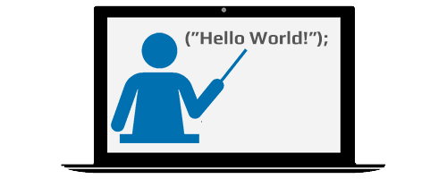

# MicroPython

---

MicroPyhon bring the Python scripting language to small microcontrollers. While TinyCLR OS with .NET C# and full debugging is the recommended path for building secure and modern devices there are instances where using MicroPython can be useful.

The MicroPython project is found at http://www.micropython.org/. GHI Electronics makes a ready-to-use MicroPythin build for some of its products.

Some areas where MicroPyhton shines:
* No complex software tools to setup. MicroPython is all-self-contained. Any serial terminal is enough to command/control/update the device.
* REPL allows for writing pure code on the device directly, where the device itself would compile and interpret.
* Python is a powerful scripting language that is relatively-easy to learn.
* Develop on any operating system as long as there is a terminal software!

Reasons to use TinyCLR OS over MicroPython:
* True secure hardware with many security services.
* Solid and complete networking support.
* Full fledged debugging experience.
* Works with world-class Microsoft Visual Studio.
* NuGet cloud hosted libraries.
* C# is C's bug sister, which is the global language for coding, especially on small devices.

The GHI Electronics fork of MicroPythin is found [here](https://www.github.com/ghi-electronics/micropython). 

---
## Getting Started

Deploy your first TinyCLR program.   [**Learn more...**](getting-started.md) 

---

## Tutorials

Learn TinyCLR embedded programming.   [**Learn more...**](tutorials/intro.md)   

---

## Downloads

Visual Studio and device downloads.   [**Learn more...**](downloads.md)

---
