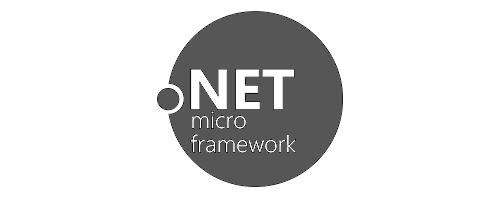

# .NET Micro Framework
---

.NET Micro Framework (NETMF) is a subset of the full Microsoft .NET Framework used to make Windows applications. NETMF initially started by Microsoft for use in SPOT watches and then later was open sourced. The latest version of Visual Studio working with our NETMF products is VS2013.

> [!Tip]
> NETMF had a great run, but now it's time for something better. TinyCLR OS continues where NETMF left off, but with added features and increased security. [**Learn more about TinyCLR OS**](../tinyclr/intro.md).

## General Resources
* [.NET Micro Framework for Beginners](http://files.ghielectronics.com/downloads/Documents/Guides/NETMF%20for%20Beginners.pdf) (ebook PDF)
* Gadgeteer mainboards and module driver [Source code](https://github.com/ghi-electronics/NETMF-Gadgeteer)
* Our .NET Micro Framework [Discussion Forum](https://forums.ghielectronics.com/c/netmf-gadgeteer)

---
## Getting Started

Deploy your first NETMF program.   [**Learn more...**](getting-started.md)  

---
## Tutorials

 Learn NETMF embedded programming.   [**Learn more...**](tutorials/intro.md)  |

---
## Downloads

Visual Studio and device downloads.   [**Learn more...**](downloads.md)

---

