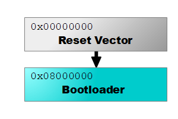

# Configuration
---

This section covers some of the configuration needed before you can program your board as well as design considerations for designing custom circuit boards.

|  |  |
|--|--|
|  **Special Pins**   Special pins used by the SITCore product line. [**Learn more...**](special-pins.md)  |  **Bootloader**   Bootloader information and downloads [**Learn more...**](bootloader.md) |
|     |    |
|  **TinyCLR Config**   Used to load firmware and applications. [**Learn more...**](tinyclr-config.md)  |  |
|    |  | 
