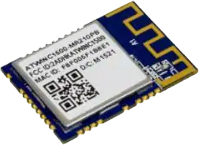

# Connectivity Drivers
---

## WINC15x0 

This utility NuGet adds additional services to the WiFi support. See [WiFi Tutorial](../tutorials/wifi.md) for more info.

> [!TIP]
> Needed NuGet: GHIElectronics.TinyCLR.Drivers.Microchip.Winc15x0

