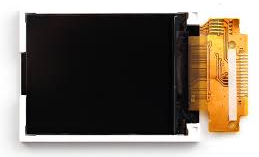
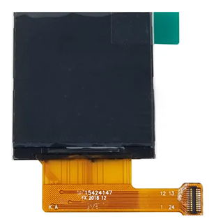
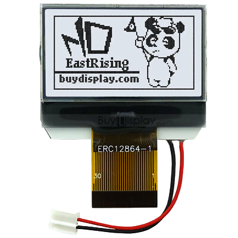
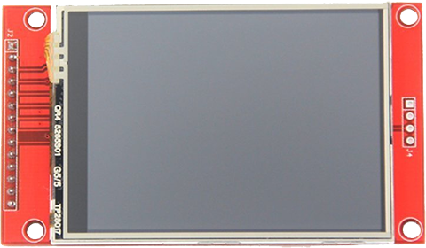
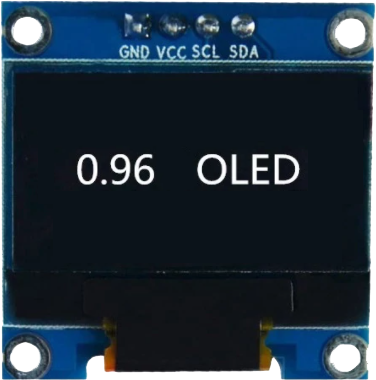
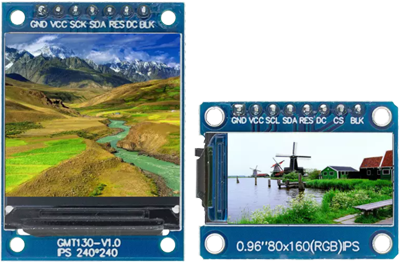

# Display Drivers
---

This page contains a collection of supported displays. On devices that support internal graphics, a user can subscribe to the drawing event, which in turn sends the image to the screen

For devices with internal graphics support, the [Graphics](../tutorials/graphics.md) tutorial, under "Virtual Displays" has a full working example on how to use the display drivers on this page. Simply change the display controller the appropriate one.

Similarly, devices that do not support internal native graphics can use the Basic Graphics under [Software Utilities](software-utility.md) instead. For displays that run natively 16BPP 5:6:5 the `DrawBuffer` is used exactly same as native graphics support. For displays that have other formats, like 1BPP, RAM can be saved by using the `DrawBufferNative` instead. In this case, the `SetPixel` method that is implemented by the user will determine the pixel format.

---

## ST7735

An SPI color display controller, typically 160x128 pixels. 

>[!TIP]
>Needed NuGet: GHIElectronics.TinyCLR.Drivers.Sitronix.ST7735

---

## ST7789

An SPI color display controller, typically 240x240 pixels.

>[!TIP]
>Needed NuGet: GHIElectronics.TinyCLR.Drivers.Sitronix.ST7789

---

## ERC12864

An SPI based mono color display controller, typically 128x64 pixels.

>[!TIP]
>Needed NuGet: GHIElectronics.TinyCLR.Drivers.EastRising.ERC12864

---

## ILI9341

An SPI based mono color display controller, typically 320x240 pixels.

>[!TIP]
>Needed NuGet: GHIElectronics.TinyCLR.Drivers.HiLetgo.ILI9341

---

## SSD1306

An I2C mono color display controller, typically 128x64 pixels.

>[!TIP]
>Needed NuGet: GHIElectronics.TinyCLR.Drivers.SolomonSystech.SSD1306

---

## SSD1351

An I2C color display controller, typically 128x128 pixels. 

>[!TIP]
>Needed NuGet: GHIElectronics.TinyCLR.Drivers.SolomonSystech.SSD1351

---

