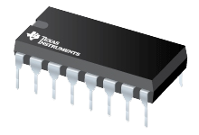

# IO Control Drivers

---

## PCA9685

16-channel servo/PWM driver that uses I2C

> [!TIP]
> Needed NuGet: GHIElectronics.TinyCLR.Drivers.Nxp.PCA9685

---

## CD4017B

CMOS decade counter. Good for scanning a matrix of LEDs or buttons.

> [!TIP]
> Needed NuGet: GHIElectronics.TinyCLR.Drivers.TexasInstruments.CD4017B

---

## SNx4HC595

Shift register, taking a serial data, like from SPI or pin bit-banging to output 8 parallel outputs. For example, drive 8 LEDs using SPI.

> [!TIP]
> Needed NuGet: GHIElectronics.TinyCLR.Drivers.TexasInstruments.SNx4HC595

---

## Rotary Encoder

A rotary encoder is an electro-mechanical device that converts the angular position to analog or digital output signals.

> [!TIP]
> Needed NuGet: GHIElectronics.TinyCLR.Drivers.Encoder

