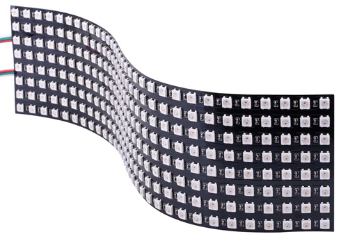

# LED Drivers

---

## LED Matrices



This example uses the WS2812 LED but applies to all matrices.

> [!TIP]
> Needed NuGets: GHIElectronics.TinyCLR.Drivers.Worldsemi.WS2812, GHIElectronics.TinyCLR.Drivers.BasicGraphis

LedMatrix Class
```cs
class LedMatrix : BasicGraphics{
    private int row, column;
    WS2812Controller leds;

    public LedMatrix(GpioPin pin, int row, int column){
        this.row = row;
        this.column = column;
        var sg = new SignalGenerator(pin);
        this.leds = new WS2812Controller(sg, this.row * this.column);           
        Clear();
    }

    public override void Clear(){
        leds.Clear();
    }

    public override void SetPixel(int x, int y, uint color){
        if (x < 0 || x >= this.column) return;
        if (y < 0 || y >= this.row) return;

        // even columns are inverted
        if((x & 0x01) !=0){
            y = this.row -1 - y;
        }
            
        var index = x * this.row + y;

        leds.SetColor(index, (int) (color >> 16) & 0xff, (int)(color >> 8) & 0xff, (int)(color >> 0) & 0xff);
    }
    public void Flush(){
        leds.Flush();
    }
}
```
Use the LEDMatrix Class as shown

```cs
var pin = GpioController.GetDefault().OpenPin(SC20100.GpioPin.PC6);
var screen = new LedMatrix(pin, 8, 32);

screen.Clear();
var col = LedMatrix.ColorFromRgb(0, 20, 50);

var c = 0;
while (true){
    screen.Clear();
    screen.DrawString(c++.ToString(), col, 0, 0);
    screen.Flush();
    Thread.Sleep(10);
}
```
---


## WS2812

The WS2812 uses digital signal or signal generator to control LEDs. Read more about digital signals [here](../tutorials/signal-control.md). Digital signal can only use specific pins, but is very accurate. Signal generator can be used on any pins but is less accurate. 

> [!Note]
> These LEDs are commonly referred to as Neopixel

> [!TIP]
> Needed NuGet: GHIElectronics.TinyCLR.Drivers.Worldsemi.WS2812

Digital Signal
```cs
var gpio = GpioController.GetDefault();
var digitalSignalPin = gpio.OpenPin(SC20260.Timer.DigitalSignal.Controller5.PA0);
var digitalSignal = new DigitalSignal(digitalSignalPin);

var led = new WS2812Controller (digitalSignal, 24);

led.SetColor(1, 255, 0, 0); // 2nd LED is Red
led.Flush();
```

Signal Generator
```cs
var gpio = GpioController.GetDefault();
var signalPin = gpio.OpenPin(SC20260.GpioPin.PE11);
var signalGen = new SignalGenerator(signalPin);

var led = new WS2812Controller(signalGen, 24);

led.SetColor(1, 255, 0, 0); // 2nd LED is Red
led.Flush();
```

---


## APA102C

> [!TIP]
> Needed NuGet: GHIElectronics.TinyCLR.Drivers.ShijiLighting.APA102C

The APA102C is very similar to the Neopixel WS2812 except it uses standard 3 wire SPI, while the Neopixel uses a single wire and it's own proprietary format. 

```cs
var cs = GpioController.GetDefault().OpenPin(SC20260.GpioPin.PE4);

var settings = new SpiConnectionSettings() {
    ChipSelectType = SpiChipSelectType.Gpio,
    ChipSelectLine = cs,
    Mode = SpiMode.Mode1,
    ClockFrequency = 4_000_000,
};

var spiBus = SpiController.FromName(SC20100.SpiBus.Spi4);
var led = new APA102CCController(spiBus, 24);

led.SetColor(1, 255, 0, 0); // 2nd LED is Red
led.Flush();
```


---
## LPD8806

> [!TIP]
> Needed NuGet: GHIElectronics.TinyCLR.Drivers.GreeledElectronics.LPD8806

```cs
var cs = GpioController.GetDefault().OpenPin(SC20260.GpioPin.PE4);

var settings = new SpiConnectionSettings() {
    ChipSelectType = SpiChipSelectType.Gpio,
    ChipSelectLine = cs,
    Mode = SpiMode.Mode1,
    ClockFrequency = 4_000_000,
};

var spiBus = SpiController.FromName(SC20100.SpiBus.Spi4);
var led = new LPD8806Controller(spiBus, 24);

led.SetColor(1, 255, 0, 0); // 2nd LED is Red
led.Flush();
```


