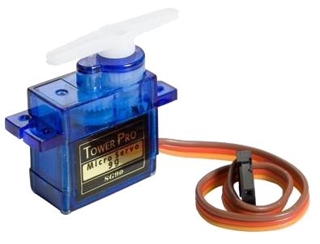

# Motor Drivers

---

## Servos

Rotational and positional servos are supported. See the [PWM](../tutorials/pwm.md) tutorial on example use.

> [!TIP]
> Needed NuGet: GHIElectronics.TinyCLR.Drivers.Servo

