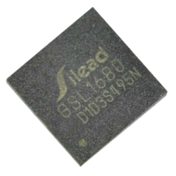
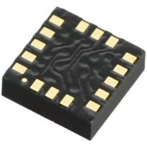
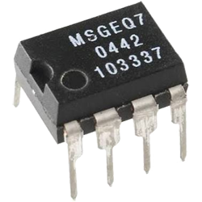

# Sensor Drivers

---

## Resistive Touch

This driver uses 2 analog and 2 digital pins to read a display's resistive touch panel. The results are not very accurate but it is a low-cost options. Please see the [Touch Screen](../tutorials/touch-screen.md) tutorial for more info.

> [!TIP]
> Needed NuGet: GHIElectronics.TinyCLR.Drivers.Touch.ResisitiveTouch

---

## FT5xx6 and GSL1680


These are common display capacitive touch controller chips. PPlease see the [Touch Screen](../tutorials/touch-screen.md) tutorial for more info.

> [!TIP]
> Needed NuGets: GHIElectronics.TinyCLR.Drivers.FocalTech.FT5xx6 or GHIElectronics.TinyCLR.Drivers.GSL1680

---

## LIS2HH12


A 3-axis accelerometer. The driver set to 2g as default. Output value is in range -1024 to 1024.

> [!TIP]
> Needed NuGet: GHIElectronics.TinyCLR.Drivers.STMicroelectronics.LIS2HH12

```cs
var lis2hh12 = new LIS2HH12Controller(I2cController.FromName(FEZBit.I2cBus.Accelerometer));

while (true) {
	
	Debug.WriteLine("X = " + lis2hh12.X);               
	Debug.WriteLine("Y = " + lis2hh12.Y);               
	Debug.WriteLine("Z = " + lis2hh12.Z);               

	Thread.Sleep(500);
}
```

>[!TIP]
 >Needed NuGet: GHIElectronics.TinyCLR.Drivers.STMicroelectronics.LIS2HH12

---

## MSGEQ7


Equalizer sensor filter.

>[!TIP]
>Needed NuGet: GHIElectronics.TinyCLR.Drivers.MixedSignalIntegrated.MSGEQ7


