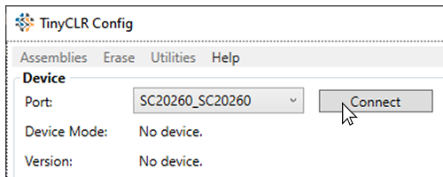
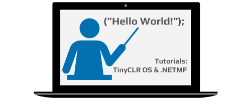
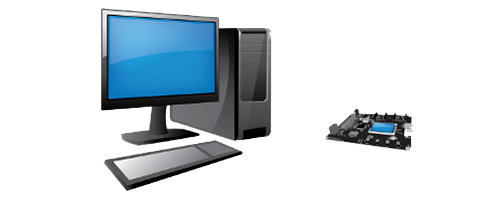

## TinyCLR OS Introduction

---

TinyCLR OS started with Microsoft's .NET Micro Framework and continues to enable managed .NET development and debugging using Visual Studio on embedded devices. All you need to get started is Visual Studio (free version available), a TinyCLR device, and a USB cable.

---
## Getting Started

Deploy your first TinyCLR program.   [**Learn more...**](getting-started.md) 

---
## Configuration

Special pins, bootloader, TinyCLR Config   [**Learn more...**](configuration.md)

---
## Tutorials

Learn TinyCLR embedded programming.   [**Learn more...**](tutorials/intro.md)   

---
## Drivers

TinyCLR Drivers.   [**Learn more...**](drivers/intro.md)   

---

## Downloads

Visual Studio and device downloads.   [**Learn more...**](downloads.md)

---
## Release Notes

Find the latest changes to TinyCLR.   [**Learn more...**](release-notes.md) 

---
## Resources

 External additional TinyCLR resources.   [**Learn more...**](resources.md) 

---
## Limitations

 

How TinyCLR OS is different from full .NET.   [**Learn more...**](limitations.md) 

---

To learn more about TinyCLR embedded programming check out our [**tutorials**](tutorials/intro.md).

You can also visit our main website at [**main website**](http://www.ghielectronics.com) and our  [**community forum**](https://forums.ghielectronics.com/).

