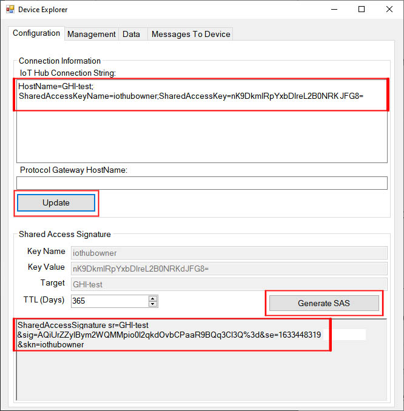
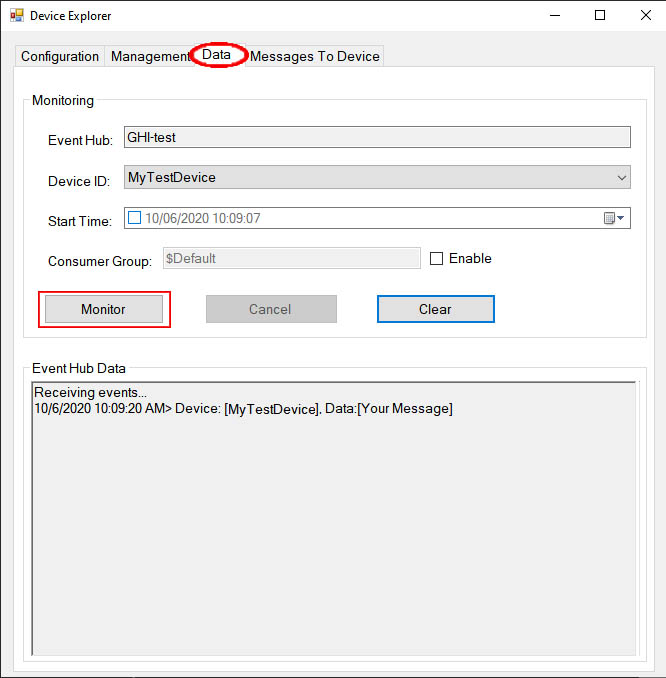
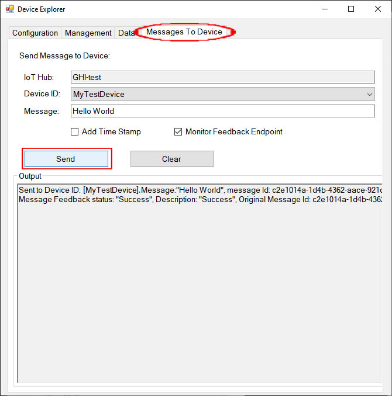

# Microsoft Azure
---

The example below shows how to use MQTT to communicate with the Azure IoT Hub.

>[!TIP]
>Needed Nugets: GHIElectronics.TinyCLR.Networking.Mqtt
>
>Needed using statement:
> using System.Security.Cryptography.X509Certificates;

```cs
var caCert = 
new X509Certificate(UTF8Encoding.UTF8.GetBytes("Need Azure certificate"));
            
var iotHubName = "your IoT Hub name";
var iotHubPort = 8883;

// device/client information
const string deviceId = "your device Id";

var username = string.Format("{0}/{1}", iotHubName, deviceId);
var password = "your string connection";

// define topics
var topicDeviceToServer = 
string.Format("devices/{0}/messages/events/", deviceId);

var topicService2Device = 
string.Format("devices/{0}/messages/devicebound/#", deviceId);

try {
    var clientSetting = new MqttClientSetting {
        BrokerName = iotHubName,
        BrokerPort = iotHubPort,
        ClientCertificate = null,
        CaCertificate = caCert,
        SslProtocol = System.Security.Authentication.SslProtocols.Tls12
    };

    var client = new Mqtt(clientSetting);

    client.PublishReceivedChanged += (a, b) => { Debug.WriteLine
        ("Received message: " + Encoding.UTF8.GetString(b.Data)); };
                
    var connectSetting = new MqttConnectionSetting {
        ClientId = deviceId,
        UserName = username,
        Password = password
    };

    var returnCode = client.Connect(connectSetting);

    ushort packetId = 1;

    client.Subscribe(new string[] { topicService2Device }, new QoSLevel[]
        { QoSLevel.ExactlyOnce }, packetId++);

    client.Subscribe(new string[] { topicDeviceToServer }, new QoSLevel[]
        { QoSLevel.ExactlyOnce }, packetId++);

    client.Publish(topicDeviceToServer, Encoding.UTF8.GetBytes
        ("Your message"), QoSLevel.MostOnce, false, packetId++);
}

catch (Exception e) {
    throw;
}
```

In the first line of code above, you need to add an Azure Certificate and place the certificate inside project resources and change the code to reflect the name of that certificate, in the example below the name is zura.

```cs
 var caCert = 
new X509Certificate(Properties.Resources.GetByte(Properties.Resources.BinaryResources.zura));
```

The example code also requires iotHubName and deviceId, which are available only when you open an Azure account. To create the iotHubName and deviceId you can follow these instructions found on their website.

[Create an IoT Hub & Device ID](https://docs.microsoft.com/en-us/azure/iot-hub/tutorial-connectivity)

We can also retrieve the Connection String for the newly created Device here too. We will use this key to generate a Shared Acccess Signature(SAS) which we will add to our code.


Once we have the Connection String, there are several ways to generate an SAS, the easiest is to use [Azure IoT Explorer](https://docs.microsoft.com/en-us/azure/iot-pnp/howto-use-iot-explorer)

Paste the Connection String you obtained inside the Connection Information box, then click 'Update'. This will automatically generate the Key Name, Key Value and Target. You can select how many days the SAS you are generating will be good for. Finally click the 'Generate SAS' button. 


Copy the SAS text generated and set to variable 'password' in our code. As shown here:
```cs
var password = "SharedAccessSignature sr=GHI-test &sig=AQiUrZZyIBym2WQMpio0I2qkdOvbCPaaR9BQq3C13Q%3d&se=1633448319&skn=iothubowner";
```
>[!TIP]
>Values used above are for reference only and will not work in your code, you must create and generate your own connection string and SAS
>

Now we can send and recieve data to our IoT device from the Azure IoT Explorer and see the results in the output window of Visual Studio and Azure IoT Explorer. To recieve data from your IoT device, add a message to send in this line of the code.

```cs
client.Publish(topicDeviceToServer, Encoding.UTF8.GetBytes
("Your message"), QoSLevel.MostOnce, false, packetId++);
```
Select the 'Data' Tab in the Azure IoT Explorer program and push the 'Monitor' button.
Deploy the program or reset the device it will automatically send "Your message" to the Azure IoT Explorer. 



To send a message from Azure to your IoT device, select the 'Messages To Device' tab in Azure IoT Explorer. Type your message in the Message Box and hit 'Send'. 



Your message will appear in the 'Output' window of Visual Studio.

 
