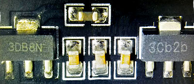

# Camera Interface
---

TinyCLR OS supports digital camera interface, sometimes referred to as DCMI or DCI, on devices using the SITCore SC20260 SoC. Typically, cameras need to be configured using [I2C bus](i2c.md). Check the Omnivision/Ov9655 driver under https://github.com/ghi-electronics/TinyCLR-Drivers for an example of how to configure your camera, or refer to the camera's manual to determine the needed configuration.

The following function captures camera images:  
```cs
public void Capture(byte[] data, int timeoutMillisecond) =>
    this.cameraController.Capture(data, timeoutMillisecond);
```

We have had problems with some of the OV9655 breakout boards we tried. These boards provide a connector for the camera ribbon cable and an 18 pin 0.1" pin header that plugs into the SCM20260D Dev board. Some of these breakout boards ship with voltage regulators that don't seem to work properly, while others work well.

Here are pictures that show the difference. The good camera has regulators labeled "3DB8N" and "3Cb2b:"

.

The bad cameras have voltage regulators labeled "2EB2S" and "3AB2I:"


## Sample Code

This example configures the camera and sends the images to the 4.3 inch display attached to the SCM20260D Dev Board.

> [!Tip]
> Needed NuGets: GHIElectronics.TinyCLR.Devices.Gpio, GHIElectronics.TinyCLR.Devices.I2c, GHIElectronics.TinyCLR.Drivers.Omnivision.Ov9655, GHIElectronics.TinyCLR.Native, GHIElectronics.TinyCLR.Pins, GHIElectronics.TinyCLR.Devices.Display, GHIElectronics.TinyCLR.Drawing
>
> Needed Namespaces: GHIElectronics.TinyCLR.Devices.Gpio, GHIElectronics.TinyCLR.Devices.I2c, GHIElectronics.TinyCLR.Drivers.Omnivision.Ov9655, GHIElectronics.TinyCLR.Native, GHIElectronics.TinyCLR.Pins, System.Diagnostics, System.Drawing

```cs
using GHIElectronics.TinyCLR.Devices.Gpio;
using GHIElectronics.TinyCLR.Devices.I2c;
using GHIElectronics.TinyCLR.Drivers.Omnivision.Ov9655;
using GHIElectronics.TinyCLR.Native;
using GHIElectronics.TinyCLR.Pins;
using System.Diagnostics;
using System.Drawing;

class Program
{
    static void Test_Dcmi()
    {
        GpioPin backlight = GpioController.GetDefault().OpenPin(SC20260.GpioPin.PA15);
        backlight.SetDriveMode(GpioPinDriveMode.Output);
        backlight.Write(GpioPinValue.High);

        var displayController =
            GHIElectronics.TinyCLR.Devices.Display.DisplayController.GetDefault();

        var controllerSetting = 
            new GHIElectronics.TinyCLR.Devices.Display.ParallelDisplayControllerSettings
        {
            Width = 480,
            Height = 272,
            DataFormat = GHIElectronics.TinyCLR.Devices.Display.DisplayDataFormat.Rgb565,
            Orientation = DisplayOrientation.Degrees0, //Rotate display.
            PixelClockRate = 10000000,
            PixelPolarity = false,
            DataEnablePolarity = false,
            DataEnableIsFixed = false,
            HorizontalFrontPorch = 2,
            HorizontalBackPorch = 2,
            HorizontalSyncPulseWidth = 41,
            HorizontalSyncPolarity = false,
            VerticalFrontPorch = 2,
            VerticalBackPorch = 2,
            VerticalSyncPulseWidth = 10,
            VerticalSyncPolarity = false,
        };

        displayController.SetConfiguration(controllerSetting);
        displayController.Enable();

        var screen = Graphics.FromHdc(displayController.Hdc);
        var controller = I2cController.GetDefault();

        // Camera
        var ov9655 = new Ov9655(controller);

        var id = ov9655.ReadId();

        Debug.WriteLine("id = " + id);

        var ptr = Memory.UnmanagedMemory.Allocate(640 * 480 * 2);
        var data = Memory.UnmanagedMemory.ToBytes(ptr, 640 * 480 * 2);

        ov9655.SetResolution(Ov9655.Resolution.Vga);

        byte temp = 0;

        while (true)
        {
            try
            {
                ov9655.Capture(data, 100);

                displayController.DrawBuffer(0, 0, 0, 0, 480, 270, 640, data, 0);
            }
            catch (System.Exception)
            { }
        }
    }

    static void Main()
    {
        Test_Dcmi();
    }
}
```

