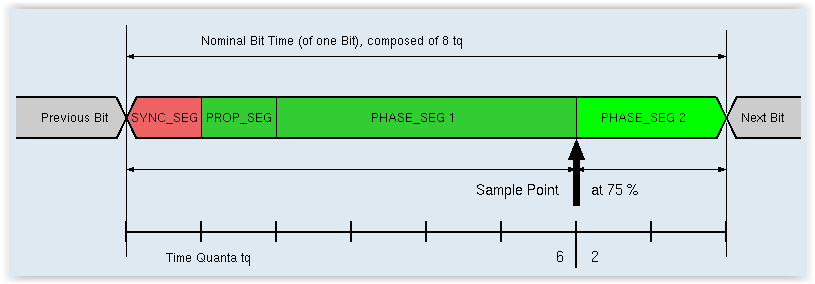

# CAN
---
Controller Area Network (CAN) bus is a two wire serial communication protocol which was originally released at the 1986 Society of Automotive Engineers (SAE) congress in Detroit.  The first vehicle to use CAN reduced the weight of its wiring by over 100 pounds. While CAN was originally designed for use in cars to reduce the amount of wiring, the use of CAN has expanded and it can now be found in avionics, hospitals, assembly lines, and even some bicycles and prosthetic limbs.

In 2012, the CAN-FD (Controller Area Network Flexible Data Rate) standard was released, increasing the bandwidth of the CAN bus while maintaining compatibility with traditional CAN. TinyCLR OS supports both traditional CAN and the newer CAN-FD.

Some features that make CAN so popular include:

* High speed (up to 1 megabit/second) serial communication over inexpensive twisted pair wiring.
* High noise immunity due to balanced differential signaling.
* Built in message priority which allows higher priority messages to automatically suppress messages of lower priority without any delay in transmission of the higher priority message.
* Guaranteed latency time for high priority messages.
* Automatic synchronization of nodes without a clock signal.
* Communication from 40 meters at 1 megabit per second up to 5 kilometers at 10 kilobits per second (distances will vary depending on bus characteristics).
* Automatic bus arbitration and collision detection and correction.
* Automatic error detection and re-transmission.
* The ability to work even when different nodes have different ground potentials.
* Only two required processor pins (Transmit Data (TD) and Receive Data (RD)).
* Low cost.

CAN bus is generally a two wire bus, but sometimes additional power and ground lines are included requiring four wires.

High speed CAN is set up as a linear bus of 120 ohm nominal twisted pair wiring with two or more nodes.  Termination resistors are used at each end of the bus as shown below.


> [!TIP]
> Some CAN devices, including our own development boards, have built in termination resistors. If you are using more than two nodes on a high speed CAN bus, you must disable the termination resistors on all nodes except for the two end nodes. 

Low speed or fault tolerant CAN uses a linear bus, star bus, or multiple star buses.  Fault tolerant CAN buses are terminated differently than linear CAN buses and require a termination resistor at each node.  The value of these resistors depends on the network but should equal about 100 ohms per CAN line in total.

## Standard CAN
The TinyCLR CAN API provides several methods for configuring the CAN bus and sending and receiving standard CAN messages. This also forms the basis upon which CAN-FD is provided.

### Configuring the Bus
CAN bit timing is a complex topic that requires considerable knowledge of the CAN protocol. If you can obtain timing parameters for a device you are connecting to, use them. All nodes on a CAN network must use the same baud rate.

Sample bit timing settings are provided further down on this page to help you get started. Please note that the given maximum oscillator tolerance and maximum cable length are theoretical maximums based only on the bit timing. These values do not take into account the number of nodes on the network, the type of cabling and termination, and the resistance of the cable, all of which may reduce the maximum bus length. It is up to you to test the network to ensure reliability.

Before you can communicate over a CAN bus, the processor needs to know the characteristics of the bus so all nodes can communicate properly.

`SetNominalBitTiming()` and `SetDataBitTiming()` define the CAN bus timing using the arguments listed below. Note that `SetDataBitTiming()` is only used for CAN-FD to specify the faster data rate. `SetNominalBitTiming()` is used both for standard CAN and to define the slower data bit rate for CAN-FD.

The `propagationPhase1` argument combines the propagation and phase1 CAN timing parameters. The propagation parameter is used to compensate for the physical delay times of the network and includes the input comparator delay, the output driver delay and the propagation delay of the bus itself (which is affected by the length and type of cable used).

The phase1 CAN timing parameter defines the length in time quanta of the phase one segment.  The phase one segment can be automatically lengthened during re-synchronization. `PropagationPhase1` is the total of the propagation and phase1 parameters added together. It uses time quanta as it's unit of measurement.

The `phase2` argument defines the length in time quanta of the phase two segment.  The phase two segment can be automatically shortened during re-synchronization.

The `baudratePrescaler` argument determines the speed of the CAN system clock.

The `synchronizationJumpWidth` defines the maximum amount of time quanta a bit period may be lengthened or shortened during each re-synchronization.

When true, `useMultiBitSampling` will cause the bus to be sampled three times for each bit.  Its use is recommended for low to medium speed buses to filter noise on the bus line.  For high speed buses it is recommended to set this to `false`.

In the sample code at the bottom of this page, the CAN bus is communicating at one megabit per second over a short bus.

### CAN Bit Timing Settings
The following CAN bit timing parameters were calculated for our SITCore Dev Boards and provide a good starting point for setting CAN timing. These values will work with any SITCore device driving the SN65HVD230 CAN driver chip. When using a different CAN driver chip, the settings are the same but the maximum cable length may be affected.

If you are already familiar with CAN, you might notice that the Propagation and Phase 1 segments have been combined. This is very common for online CAN calculators and also the way CAN is handled by the microcontrollers used in the SITCore line of products.

| Baud | PropagationPhase1 | Phase2 | Baudrate Prescaler | Synchronization Jump Width | Use Multi Bit Sampling | Sample Point | Max Osc. Tolerance | Max Cable Length
|---|---|---|---|---|---|---|---|---|
| 33.333K | 13 | 2 | 90 | 1 | False | 87.5% | 0.31% | 2200M
| 83.333K | 13 | 2 | 36 | 1 | False | 87.5% | 0.31% | 850M
| 125K    | 13 | 2 | 24 | 1 | False | 87.5% | 0.31% | 550M
| 250K    | 13 | 2 | 12 | 1 | False | 87.5% | 0.31% | 250M
| 500K    | 13 | 2 | 6  | 1 | False | 87.5% | 0.31% | 100M
| 1M      | 13 | 2 | 3  | 1 | False | 87.5% | 0.31% | 40M

*Note: Maximum Oscillator Tolerance and Maximum Cable Length are theoretical maximums and must be tested to ensure reliability.*

### Calculating Your Own CAN Bit Timing

There are many online CAN calculators that can be used to help you with CAN timing. One of the better ones is here: [http://www.bittiming.can-wiki.info/](http://www.bittiming.can-wiki.info/). This page also has a lot of useful information about CAN including this helpful visualization of the time segments that comprise one bit of CAN data:



To use a CAN calculator, you will need to know the microcontroller's CAN clock speed. For the SITCore series of chips and SoMs this is 48 MHz, and can easily be found with the SourceClock property. For example, if your CAN controller is named "can," `Debug.WriteLine(can.SourceClock.ToString());` will display the CAN clock frequency in Hertz in the output window. 

### Sending CAN Messages

#### WriteMessage()
`WriteMessage()` writes a single CAN message.  Each CAN message is defined by eight data bytes, an arbitration ID, the length (number of bytes to send), and two Boolean arguments which specify if the transmission is a remote transmission request and whether the message uses an extended arbitration ID.  Extended arbitration IDs are 29 bits long, standard IDs are 11 bits long.

#### WriteMessages()
The `WriteMessages()` method is used to send an array of CAN messages.  The arguments for this function are the array of CAN messages followed by an `offset` and `count` integer values.  The `offset` is the array subscript of the first message to send, while `count` specifies how many messages to send.
 
### Receiving CAN Messages

#### ReadMessage()
`ReadMessage()` receives a CAN message and includes the `ArbitrationId`, `IsExtendedId`, `IsRemoteTransmissionRequest`, `TimeStamp` and `Data` properties.

### Filtering Incoming CAN Messages
Filters can be set to automatically accept or ignore messages based on their arbitration ID.

#### AddRangeFilter()
`AddRangeFilter()` allows you to set a range of arbitration IDs that will be accepted as valid messages. Messages with arbitration IDs outside of this range will be ignored. You can add more than one range filter. In the sample code below, the range filters will accept messages with arbitration IDs ranging from `0x12` to `0x20` and also between `0x500` and `0x1000` inclusive.

#### AddMaskFilter()
`AddMaskFilter()` can be used to specify an individual arbitration ID or a range of arbitration IDs that will be accepted regardless of the group filter settings. If the arbitration ID of the message is bitwise anded with the given mask argument, and the result is equal to the compare argument you provide, the message will be accepted.

In the sample code below, CAN messages with arbitration IDs of `0x11`, `0x13`, and `0x5678` will be accepted in addition to the arbitration IDs specified by the group filters.

## Sample Code
The following sample code is written for our SITCore SC20100S Dev Board.

> [!Tip]
> Needed NuGets: GHIElectronics.TinyCLR.Core, GHIElectronics.TinyCLR.Devices and GHIElectronics.TinyCLR.Pins
 
```cs
using GHIElectronics.TinyCLR.Devices.Can;
using GHIElectronics.TinyCLR.Devices.Gpio;
using GHIElectronics.TinyCLR.Pins;
using System;
using System.Diagnostics;
using System.Threading;

class Program {
    private static void Main() {
        var LdrButton = GpioController.GetDefault().OpenPin(SC20100.GpioPin.PE3);
        LdrButton.SetDriveMode(GpioPinDriveMode.InputPullUp);

        var can = CanController.FromName(SC20100.CanBus.Can1);

        var propagationPhase1 = 13;
        var phase2 = 2;
        var baudratePrescaler = 3;
        var synchronizationJumpWidth = 1;
        var useMultiBitSampling = false;

        can.SetNominalBitTiming(new CanBitTiming(propagationPhase1, phase2, baudratePrescaler,
            synchronizationJumpWidth, useMultiBitSampling));        

        var message = new CanMessage() {
            Data = new byte[] { 0x48, 0x65, 0x6C, 0x6C, 0x6F, 0x2E, 0x20, 0x20 },
            ArbitrationId = 0x11,
            Length = 6,
            RemoteTransmissionRequest = false,
            ExtendedId = false,
            FdCan = false,
            BitRateSwitch = false
        };

        //The following filter will accept arbitration IDs from 0x12 to 0x20 inclusive.
        can.Filter.AddRangeFilter(Filter.IdType.Standard, 0x12, 0x20);

        //The following filter will accept arbitration IDs from 0x500 to 0x1000 inclusive.
        can.Filter.AddRangeFilter(Filter.IdType.Standard, 0x500, 0x1000);

        //The following filter will accept arbitration IDs of 0x11 and 0x13.
        can.Filter.AddMaskFilter(Filter.IdType.Standard, 0x11, 0xFD);

        //The following filter will accept arbitration IDs of 5678 only.
        can.Filter.AddMaskFilter(Filter.IdType.Standard, 0x5678, 0xFFFF);

        can.MessageReceived += Can_MessageReceived;
        can.ErrorReceived += Can_ErrorReceived;
        
        can.Enable();

        while (true) {
            if (LdrButton.Read() == GpioPinValue.Low)
                can.WriteMessage(message);

            Thread.Sleep(100);
        }
    }

    private static void Can_MessageReceived(CanController sender,
        MessageReceivedEventArgs e) {

        sender.ReadMessage(out var message);

        Debug.WriteLine("Arbitration ID: 0x" + message.ArbitrationId.ToString("X8"));
        Debug.WriteLine("Is extended ID: " + message.ExtendedId.ToString());
        Debug.WriteLine("Is remote transmission request: "
            + message.RemoteTransmissionRequest.ToString());

        Debug.WriteLine("Time stamp: " + message.Timestamp.ToString());

        var data = "";
        for (var i = 0; i < message.Length; i++) data += Convert.ToChar(message.Data[i]);

        Debug.WriteLine("Data: " + data);
    }

    private static void Can_ErrorReceived(CanController sender, ErrorReceivedEventArgs e)
        => Debug.WriteLine("Error " + e.ToString());
}
```

## CAN-FD
CAN-FD allows for faster data transmission and larger data packet size to increase throughput. At the same time, CAN-FD is compatible with traditional CAN -- CAN-FD and standard CAN nodes can even coexist on the same CAN bus!

CAN-FD can be used by setting the `FdCan` property of your CAN message to `true`. This setting will allow you to send up to 64 bytes of data per CAN message.

To send the data at higher speed you will also need to set two bit timings, one for the normal, slower speed (`SetNominalBitTiming()`), and one for the faster speed (`SetDataBitTiming()`). You will also have to set the `BitRateSwitch` property of the CAN message to `true.`

The following code shows the changes needed to make the above code sample use CAN-FD with speeds of 250 kilobaud and 1 megabaud.

```cs
var propagationPhase1 = 13; //250 kilobaud settings
var phase2 = 2;
var baudratePrescaler = 12;
var synchronizationJumpWidth = 1;
var useMultiBitSampling = false;

//Set the lower CAN speed to 250 kilobaud.
can.SetNominalBitTiming(new CanBitTiming(propagationPhase1, phase2, baudratePrescaler,
    synchronizationJumpWidth, useMultiBitSampling));

baudratePrescaler = 3;  //Change bit timing to 1 megabaud.
        
//Set faster CAN speed to 1 megabaud.
can.SetDataBitTiming(new CanBitTiming(propagationPhase1, phase2, baudratePrescaler,
    synchronizationJumpWidth, useMultiBitSampling));

can.Enable();

var message = new CanMessage() {
    Data = new byte[] { 0x48, 0x65, 0x6C, 0x6C, 0x6F, 0x2E, 0x20, 0x20 },
    ArbitrationId = 0x11,
    Length = 6,
    RemoteTransmissionRequest = false,
    ExtendedId = false,
    FdCan = true,
    BitRateSwitch = true
};

```
