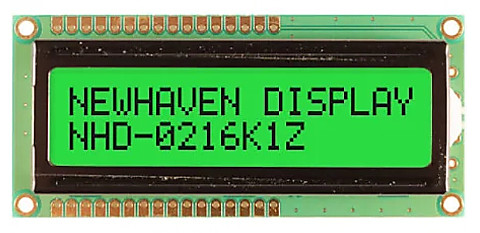

# Displays
---
Graphical Displays can be grouped into two distinct interface categories, built-in parallel TFT displays and virtual displays, typically serial (SPI/I2C) displays. 

There are also non-graphical character displays and those work through a simple driver, not using the [graphics](graphics.md).

The display drivers are meant to transfer the pixel data from memory to the actual display. The [graphics](graphics.md) tutorial shows how drawing is done in memory.

---

## Native Displays
These displays connect to special dedicated pins on the processor. Internally, the display controller automatically transfers (refreshes) the display directly from memory without any processor interaction, using DMA. When the system needs to update the display, it simply writes to memory. Neither the operating system nor the application program are burdened with display processing. The down side to this is that the system needs to have enough RAM to handle the display. An 800x600 display with 16bpp needs 960,000 bytes!

---

## Virtual Displays
The internal graphics services can be mapped to work with virtual display displays, such as SPI displays. See the [Graphics](graphics.md) tutorial for more information and sample code.

---

## Character Displays


These displays are capable of only showing characters. Most of these displays use the HD44780 controller. They are available in different sizes, but two lines of 16 characters is most common. These displays only require GPIO pins and can be used with TinyCLR. Sample code for HD44780 displays can be found in our GitHub [Samples Repo](https://github.com/ghi-electronics/TinyCLR-Samples).

---

## Low Level Display Access
TinyCLR also provides low level display access as part of the `GHIElectronics.TinyCLR.Devices.Display` library. These methods provide a simple way to write to a display without need for the `System.Drawing` library or an added font resource file.

> [!Tip]
> The low level support should only be used in advanced edge cases only.

The following example is written for the SC20260D Dev Board with the 4.3" display. It will paint the screen as shown in the picture beneath the code. Note that low level display access requires that you use the data format required by your display as configured. The SC20260D Dev Board used in this example expects each pixel to have 16 bits (two bytes per pixel) of color information in RGB565 format.

> [!Tip]
> Needed NuGets: GHIElectronics.TinyCLR.Core, GHIElectronics.TinyCLR.Devices.Display, GHIElectronics.TinyCLR.Devices.Gpio, GHIElectronics.TinyCLR.Devices.I2c, GHIElectronics.TinyCLR.Devices.Spi, GHIElectronics.TinyCLR.Native, and GHIElectronics.TinyCLR.Pins.

```cs
using GHIElectronics.TinyCLR.Devices.Display;
using GHIElectronics.TinyCLR.Devices.Gpio;
using GHIElectronics.TinyCLR.Pins;

GpioPin backlight = GpioController.GetDefault().OpenPin(SC20260.GpioPin.PA15);
backlight.SetDriveMode(GpioPinDriveMode.Output);
backlight.Write(GpioPinValue.High);
var displayController = DisplayController.GetDefault();

// Enter the proper display configurations
displayController.SetConfiguration(new ParallelDisplayControllerSettings{
    Width = 480,
    Height = 272,
    DataFormat = GHIElectronics.TinyCLR.Devices.Display.DisplayDataFormat.Rgb565,
    Orientation = DisplayOrientation.Degrees0, //Rotate display.
    PixelClockRate = 10000000,
    PixelPolarity = false,
    DataEnablePolarity = false,
    DataEnableIsFixed = false,
    HorizontalFrontPorch = 2,
    HorizontalBackPorch = 2,
    HorizontalSyncPulseWidth = 41,
    HorizontalSyncPolarity = false,
    VerticalFrontPorch = 2,
    VerticalBackPorch = 2,
    VerticalSyncPulseWidth = 10,
    VerticalSyncPolarity = false,
});

displayController.Enable();
byte[] myPic = new byte[480 * 272 * 2];

for (var i = 0; i < myPic.Length; i++){
    myPic[i] = (byte)(((i % 2) == 0) ?
        ((i / 4080) & 0b00000111) << 5 : i / 32640);
}

displayController.DrawString("\f");     
displayController.DrawBuffer(0, 0, 0, 0, 480, 272, 480, myPic, 0);
displayController.DrawString("GHI Electronics\n");
displayController.DrawString("Low Level Display Demo.");

for (var x = 20; x < 459; x++){
    displayController.DrawPixel(x, 50, 0xF800);     //Color is 31,0,0 (RGB565).
    displayController.DrawPixel(x, 51, 0xF800);
}
```

SCM20260D Dev Board 4.3" display after running the sample code:


