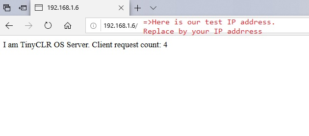

# HTTP/HTTPS
---
Hyper Text Transport Protocol (HTTP) builds on top of the [Core Networking Protocols](core-protocols.md) to provide a standard way to work with web servers.

## HTTP Client
The following code connects to bing.com and reads the robots.txt file. This code needs an active network connection to work properly.

>[!TIP]
>Needed NuGets: GHIElectronics.TinyCLR.Core, GHIElectronics.TinyCLR.Devices.Network and GHIElectronics.TinyCLR.Networking.Http.

```cs
static void TestHttp()
{
    var url = "http://www.bing.com/robots.txt";

    int read = 0, total = 0;
    byte[] result = new byte[512];

    try
    {
        using (var req = HttpWebRequest.Create(url) as HttpWebRequest)
        {
            req.KeepAlive = false;                    
            req.ReadWriteTimeout = 2000;

            using (var res = req.GetResponse() as HttpWebResponse)
            {
                using (var stream = res.GetResponseStream())
                {
                    do
                    {
                        read = stream.Read(result, 0, result.Length);
                        total += read;

                        System.Diagnostics.Debug.WriteLine("read : " + read);
                        System.Diagnostics.Debug.WriteLine("total : " + total);

                        String page = "";

                        page = new String(System.Text.Encoding.UTF8.GetChars
                            (result, 0, read));

                        System.Diagnostics.Debug.WriteLine("Response : " + page);
                    }

                    while (read != 0);
                }
            }
        }  
    }
    catch
    {
                
    }
}

```

## HTTP Server

TinyCLR OS provides an HttpListener class which can be used to make an HTTP Server. This code needs an active network connection on the same local network as your client application to work properly.

>[!TIP]
>Needed NuGets: GHIElectronics.TinyCLR.Core, GHIElectronics.TinyCLR.Devices.Network and GHIElectronics.TinyCLR.Networking.Http.

> [!Note]
> To run this example the client and server devices must both connect to the same local network.

```cs
static void TestHttpServer() {
    //Create a listener.
    HttpListener listener = new HttpListener("http", 80);

    listener.Start();
    System.Diagnostics.Debug.WriteLine("Listening...");

    var clientRequestCount = 0;

    while (true) {
        //Note: The GetContext method blocks while waiting for a request.
        HttpListenerContext context = listener.GetContext();

        //Obtain a response object.
        HttpListenerResponse response = context.Response;

        //Construct a response.                
        var responseString = string.Format("<HTML><BODY> I am TinyCLR OS Server." +
            "Client request count: {0}</BODY></HTML> ", ++clientRequestCount);                
        
        byte[] buffer = System.Text.Encoding.UTF8.GetBytes(responseString);

        //Get a response stream and write the response to it.
        response.ContentLength64 = buffer.Length;
        var output = response.OutputStream;

        output.Write(buffer, 0, buffer.Length);

        //You must close the output stream.
        output.Close();
    }

    listener.Stop();
}
```

From your client device (smartphone, PC...), enter the server ip address into your web browser. In our case it's 192.168.1.6. The response is shown as below:



## HTTPS

Secure connections work in a similar way through built in [TLS](tls.md) support.

HTTPS can also be used to send data to cloud computing services such as [Azure](azure.md).
