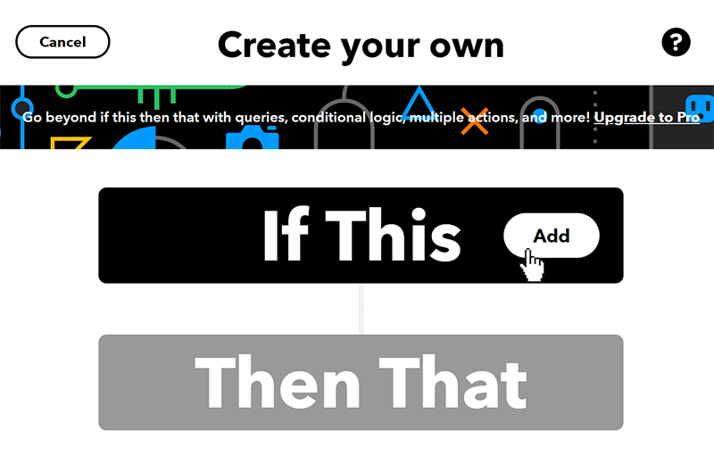
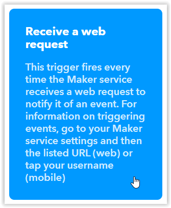
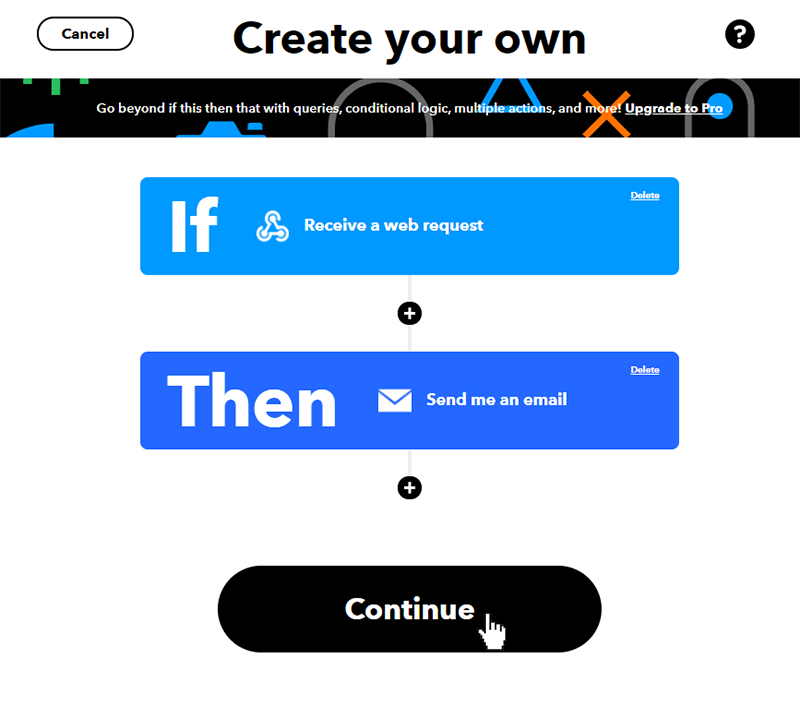
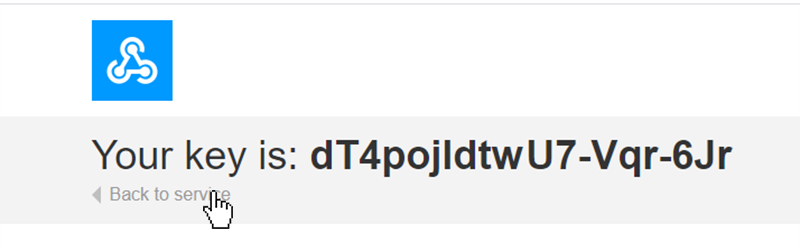

# IFTTT
---
## If This Then That IOT Example.
If This Then That (IFTTT) is a service allowing users to automate tasks by using simple conditional statements to create scripts or Applets (previously called "recipes"). Some similar platforms you might want to check out include [Twilio](https://www.twilio.com/), [ThingSpeak](https://thingspeak.com/), [Yonomi](https://www.yonomi.com/), and [Home Assistant](https://www.home-assistant.io/). IFTTT can be used to respond to both events on websites and events from devices. Some uses include:

* Turn on the lights when you come home.
* Send a text message if rain is forecast.
* Turn on your lights if your Ring doorbell senses motion.
* Turn off your WiFi when you aren't home.
* Send you an e-mail when the New York Times publishes a new article in its science section.
* Automatically back up your smart phone photos to the cloud.
* Automate GitHub tasks.
* Get a text message whenever a Craigslist post matches your search.
* Notify you when the International Space Station passes overhead.
* Track when your company is mentioned on Twitter or Reddit.

The possibilities are almost endless. Here we will take you step by step through the process using IFTTT to send an email notification of a button being pressed on a SITCore Dev Board. First we will set up an IFTTT account, then create and test the needed applets, and finally program the SITCore to trigger the IFTTT applet.

### Create an IFTTT Account

Signing up for IFTTT is easy and they offer a free limited account, but it only allows up to 3 applets. Their paid service offers unlimited applet creation, queries, conditional logic and multiple actions -- just go to [IFTTT.com](https://ifttt.com) and click on the `Sign up` button in the upper right hand corner of the screen. You can sign up using your Google or Facebook account, or use an e-mail address and password to sign in. IFTTT will usually offer to set up a sample connection right after you sign up -- just hit the "X" in the upper right corner to skip this step. Click on the `Get more` button under the message `Start connecting your world` to get started.


### Create the IFTTT Applets

Two IFTTT applets will be needed for this project. An Email Applet will be send an email when a button is pushed. A Webhooks Applet will be used to receive an HTTP GET request from the FEZ when the temperature goes below ten degrees. Finally, an If This Then That Applet will call the Email Applet when triggered by the Webhooks Applet.

#### Create the Webhooks Applet

After signing up click on `Create` button in the top menu. 


You will then be presented with a screen that may seem to provide no option forward. Click on `If This Add` to get to the next step.



Search for `webhooks` and click on that option.


On the next screen click on the `Connect` button, then click on the `Receive a web request` box on the following screen.



You will be prompted for an event name. Enter `button_press` and press the `Create trigger` button.


Now click on `+That`. This will take us to the next step of choosing an action service -- in this case we will send an email.


#### Create the Email Applet

You should now be on the `Choose action service` screen. Search for `email` and then click on the `email` icon.


Click on the `Connect` button on the next screen. You will be prompted for an email address to send notifications to. Type in the email address you would like to use and press the `Send PIN` button. Once you receive the email with your PIN, enter the PIN and hit the `Connect` button.

Now click on the `Send me an email` box.


You should now be on the `Complete action fields` screen. Click on the `Create action` button without making any changes. This will tell IFTTT to use the default method of constructing the subject line and body of the notification email.


This will then take you back to the main If Then page. Click on continue



Finally we're at the `Review and finish` screen. Click on the `Finish` button.

#### Get Your Key

Now we just have to get the key that is sent from the SITCore to trigger the event. You should now be at a screen with the text "If Maker Event "button_press", then Send me an email at. . . Click on the Webhooks icon as shown below:


Then click on the `Documentation` button near the upper right of the next screen. This will bring up a page with your unique key. Including this key in an HTTP GET or POST request to the IFTTT website will trigger your event.



To test the IFTTT event, you can enter the following line into the address bar of your web brower (replace Your_Key_Here with your key) : https://maker.ifttt.com/trigger/button_press/with/key/Your_Key_Here


### Setup the SITCore

To setup the FEZ we will have to connect a temperature sensor and then program the FEZ to send the proper HTTP GET request when the temperature drops below 10 degrees.

#### Connect the Temperature Sensor

For this demo we programmed the FEZ to act as a temperature alarm, but the same principles can be applied to any sensor that can be connected to the FEZ. You can also test the program without any sensor at all - just call SendSmsAlert() to simulate an alarm condition.

For our temperature sensor we used an NPN transistor (2N2222A) and an 8.2K resistor as they were sitting conveniently on my desk. They were wired as shown below. Power for the temperature sensor is controlled by GPIO pin A1. 3V3 could have been used, but by using a GPIO pin the sensor can be turned off between readings to reduce the effects of self heating.


The transistor is wired with its base and collector connected together so it is acting as a diode. When a constant current passes through this diode the voltage drop is a linear function with a temperature coefficient of about two millivolts per degree celsius. While a series resistor does not provide a true constant current source, it will be plenty accurate for this demo.

#### Programming the FEZ

Start a new C# project. You will need to add the following NuGet packages:

* GHIElectronics.TinyCLR.Core
* GHIElectronics.TinyCLR.Devices.Adc
* GHIElectronics.TinyCLR.Devices.Gpio
* GHIElectronics.TinyCLR.Devices.Spi
* GHIElectronics.TinyCLR.Native
* GHIElectronics.TinyCLR.Networking
* GHIElectronics.TinyCLR.Networking.Http
* GHIElectronics.TinyCLR.Pins

Cut and paste the following code into the `Program.cs` window. You will have to change the WiFi SSID and password (line 50) and cut and paste your IFTTT key into line 53 near the end of the program (replace `Paste_IFTTT_Key_Here`). To copy your key, click on `My Applets` on the IFTTT website, then click on `Services`, click on the `Webhooks` box, and click on the `Documentation` button.

```cs
using GHIElectronics.TinyCLR.Devices.Adc;
using GHIElectronics.TinyCLR.Devices.Gpio;
using GHIElectronics.TinyCLR.Devices.Spi;
using GHIElectronics.TinyCLR.Drivers.STMicroelectronics.SPWF04Sx;
using GHIElectronics.TinyCLR.Pins;
using System;
using System.Threading;

class Program {
    private static void Main() {
        var gpioCont = GpioController.GetDefault();
        var reset = gpioCont.OpenPin(FEZ.GpioPin.WiFiReset);
        var irq = gpioCont.OpenPin(FEZ.GpioPin.WiFiInterrupt);
        var wifiGpio8 = gpioCont.OpenPin(FEZCLR.GpioPin.PA0);
        var tempSensePower = gpioCont.OpenPin(FEZ.GpioPin.A1);

        var spiCont = SpiController.FromName(FEZ.SpiBus.WiFi);
        var spi = spiCont.GetDevice(SPWF04SxInterface.GetConnectionSettings(SpiChipSelectType.Gpio, FEZ.GpioPin.WiFiChipSelect));

        var adcController = AdcController.GetDefault();
        var tempSense = adcController.OpenChannel(FEZ.AdcChannel.A0);

        tempSensePower.SetDriveMode(GpioPinDriveMode.Output);
        tempSensePower.Write(GpioPinValue.Low);

        wifiGpio8.SetDriveMode(GpioPinDriveMode.InputPullDown);

        while (true) {
            tempSensePower.Write(GpioPinValue.High);
            var tempSenseValue = tempSense.ReadRatio();
            tempSensePower.Write(GpioPinValue.Low);

            // ADC value was 0.589 volts at 21 degrees celsius.
            // Temperature coefficient is approx. 2mv/deg C.
            var temperature = 21 - (tempSenseValue * 3.3 - 0.589) / 0.002;
            temperature = Math.Round(temperature * 10) / 10;

            if (temperature < 10) {
                SendSmsAlert(temperature);
                Thread.Sleep(2 * 60 * 60 * 1000);   // Don't alert more than once every 2 hrs.
            }
            Thread.Sleep(1000);
        }

        void SendSmsAlert(double temperature) {
            var wifi = new SPWF04SxInterface(spi, irq, reset);

            wifi.TurnOn();
            Thread.Sleep(10000);

            wifi.JoinNetwork("SSID", "password");
            Thread.Sleep(10000);

            var triggerString = "/trigger/FEZ_Temp_Alert/with/key/Paste_IFTTT_Key_Here?value1=" + temperature.ToString();
            wifi.SendHttpGet("maker.ifttt.com", triggerString, 80, SPWF04SxConnectionSecurityType.None);

            wifi.TurnOff();
            wifi.Dispose();
        }
    }
}

```


