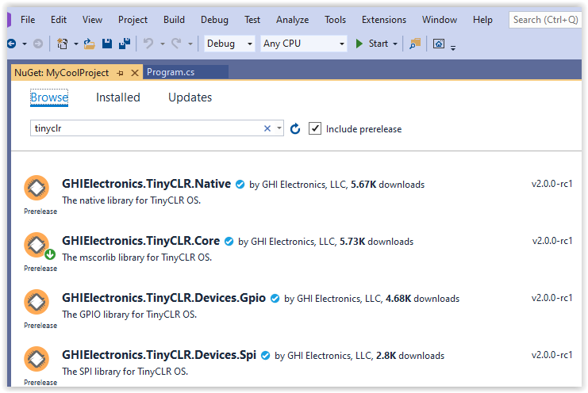
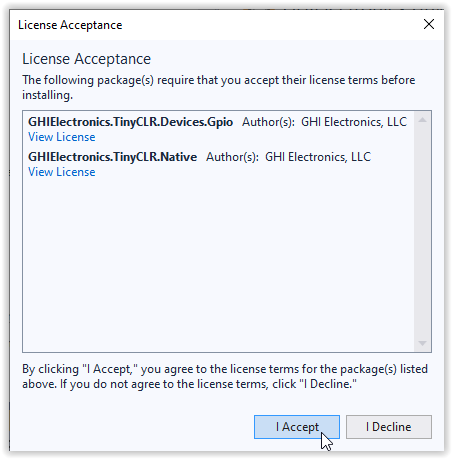

# NuGet

---

All libraries are hosted in the cloud using the industry standard NuGet format on www.NuGet.org. Not only is it easy to install and upgrade libraries, it is also easy to create and publish custom libraries.
 
The steps below explain how to add online-hosted NuGet libraries to your project. If you are using a pre-release, the libraries must be [downloaded](../downloads.md) and installed as a local feed.

1. Start Visual Studio and create a new `TinyCLR Application` under `C# > TinyCLR`. New to Visual Studio or C#? Take a look at the [getting started guide from Microsoft](https://docs.microsoft.com/en-us/dotnet/csharp/getting-started/with-visual-studio).
2. Right click on your Project in the Solution Explorer panel and select `Manage NuGet Packages`.  If the Solution Explorer window is not visible, open it by selecting `Solution Explorer` in the `View` menu. You can also select `Manage NuGet Packages...` in the `Project` menu of Visual Studio.

3. Make sure the package source is set to "Package source" or "All."

4. In the search box type "tinyclr." **You may have to check the "Include prerelease" box to find the libraries.**

5. Selecting the `Browse` tab will show all the TinyCLR NuGet packages.

6. To install one of the packages click on the down arrow to the right of the package version.

You can also select the package and click on the `Install` button in the center panel.

7. Click `OK` to accept the proposed changes.

8. Accept the licensing agreement to install the package.

> [!Note]
> Pre-release libraries are not hosted on NuGet.org, use the local feed feature to fetch the needed libraries from your local machine, found on the [**Downloads**](.. /downloads.md) page.

For information on creating custom NuGet Packages, [this page](https://docs.microsoft.com/en-us/nuget/create-packages/creating-a-package) from Microsoft is a good place to start.

> [!Tip]
> Developers can use the NuGet Package Manager Console to reinstall NuGets `Update-Package -reinstall`. More details are found on [Visual Studio Docs](https://docs.microsoft.com/en-us/nuget/reference/ps-reference/ps-ref-update-package) website.

