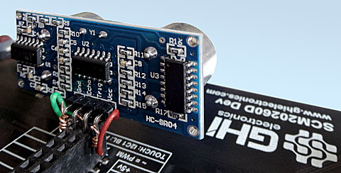
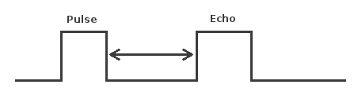

# Signal Control
---


## DigitalSignal

The DigitalSignal is used to handle digital signals! Unlike the other features on this page, DigitalSignal is accurate because it is hardware-backed and runs in a non-blocking manner.

Being hardware backed, this feature only runs on specific pins. Those pins can be found under the pins library, such as `SC20260.Timer.Capture.Controller?.xxx`. 

>[!TIP]
> Timers are also used with other features, such as PWM. Once a timer is reserved for DigitalSignal, it is no longer available for other features. However, the system includes many timer controllers.

There are two uses for DigitalSignal, to capture a stream of durations (signal analyzer) or a pulse counter. Both features can be used to capture on `RisingEdge` or `FallingEdge`. If both edges are desired, use `RisingEdge | FallingEdge`. Capturing starts immediately unless `waitForEdge` is set to `true`.

> [!WARNING]
> The `waitForEdge` uses interrupt pin internally to start the capturing cycle. Same rules apply as GPIO interrupt pins, for example when using PB3 to capture with `waitForEdge` equals `true`, PA3, PC3, PD3...etc can't be used for interrupts. See [GPIO](gpio.md) for details on interrupt pins.

### Capture
The Capture feature return an array of timestamps of individual durations. The returned values are in nanoseconds?

> [!TIP]
> Digital Signal is limited to the timer max value, which comes to be about 17.89 seconds. The `waitForEdge` helps by only starting the timer when there is an active pulse.

```cs
var digitalSignalPin = GpioController.GetDefault().OpenPin(SC20260.Timer.Capture.Controller5.PB3);

var digitalSignal = new DigitalSignal(digitalSignalPin);
bool waitForEdge = false;// Start capturing as soon as Capture is called

// Subscribe event when done capturing
digitalSignal.OnCaptureReady += Digital_OnCaptureReady;
                      
// start capture 100 samples, timeout is 15seconds
digitalSignal.Capture(100, GpioPinEdge.RisingEdge | GpioPinEdge.FallingEdge, waitForEdge, TimeSpan.FromSeconds(15));

// Wait for finish capture
// do other work
Thread.Sleep(Timeout.Infinite); 

// The event
private static void Digital_OnCaptureReady(DigitalSignal sender, uint[] buffer, uint count, GpioPinValue pinValue) {
    if (count == 0) {
        Debug.WriteLine("no data was captured!");
        return;
    }
    for (int i = 0; i < count; i++) {
        Debug.WriteLine("Sample [" + i +"]: "+ buffer[i]+" ns");
    }
}
```
> [!NOTE]
> The first captured pulse will likely have an inaccurate (shorter) value due to system prep time.

### ReadPulse
ReadPulse can be used to measure frequency and other analyses that require measuring time duration for specific pulse count.

```cs
var digitalSignalPin = GpioController.GetDefault().OpenPin(SC20260.Timer.Capture.Controller5.PB3);
var digitalSignal = new DigitalSignal(digitalSignalPin);
bool waitForEdge = true;// wait for first pulse before starting the measurement

// Subscribe event when done reading
digitalSignal.OnReadPulseReady += Digital_OnReadPulseReady;           

// Start reading 1000 pulses
digitalSignal.ReadPulse(1000, GpioPinEdge.RisingEdge, waitForEdge);

// do other work...
Thread.Sleep(Timeout.Infinite);

// the event
private static void Digital_OnReadPulseReady(DigitalSignal sender, TimeSpan duration, uint count, GpioPinValue pinValue) {
    var ticks = duration.Ticks;
    var microsecond = ((double)duration.Ticks) / 10;
    var millisecond = ((double)duration.Ticks) / 10000;
    var freq = (count / microsecond) * 1000000;

    Debug.WriteLine("GpioPinValue = " + ((pinValue == GpioPinValue.High) ? "High" : "Low"));
    Debug.WriteLine("PulseCount = " + count);
    Debug.WriteLine("Duration ticks = " + ticks);
    Debug.WriteLine("Duration microsecond = " + microsecond);
    Debug.WriteLine("Duration millisecond = " + millisecond);
    Debug.WriteLine("freq = " + freq / 1000.0 + " KHz");
}
```

---
### Abort
Each time a `ReadPulse` or `Capture` is called, an event is triggered when the operation is completed. In some cases, it may be desired to terminate the operation early, using `Abort`. When aborted, an event is still triggered, which will contain whatever data/pulses was collected from the trigger to the time `Abort` was called.

```cs
var digitalSignalPin = GpioController.GetDefault().OpenPin(SC20260.Timer.Capture.Controller5.PB3);
var digitalSignal = new DigitalSignal(digitalSignalPin);
var waitForEdge = false;

digitalSignal.OnReadPulseReady += Digital_OnReadPulseReady

while (true) {
    if (digitalSignal.CanReadPulse) {
        digitalSignal.ReadPulse(1000, GpioPinEdge.RisingEdge, waitForEdge);                  
        Thread.Sleep(1000);                    
        digitalSignal.Abort();
        Debug.WriteLine("Aborted");
    }
}
      
private static void Digital_OnReadPulseReady(DigitalSignal sender, TimeSpan duration, uint count, GpioPinValue pinValue) {
    if (count > 0) {
        var microsecond = ((double)duration.Ticks) / 10;
        var freq = (count / microsecond) * 1000000;
        Debug.WriteLine("freq = " + freq / 1000.0 + " KHz");
    }
    else {
        Debug.WriteLine("No clock found.");
    }
}
```
>[!TIP] In the sample code above you can use PWM to provide the pulse needed to verify the code. Keep in mind that both PWM and DigitalSignal share resources, so a different Timer controller must be used.

---

## Pulse Feedback

The PulseFeedback class can be used in three different modes. These modes are used to measure Echo Duration, Duration Until Echo, and Drain Duration.

### Echo Duration


Echo Duration sends a trigger pulse of a given state over the provided pin. It then waits for an echo on the other specified pin and measures the length of that echo pulse. The trigger and echo pins cannot be the same pin.

The following code will read the distance in centimeters from an HC-SR04 ultrasonic distance sensor. This sensor has a trigger pin that is pulsed high to start distance measurement. It has a separate echo pin that the sensor holds high until it receives an echo. Therefore, the time the echo pin is high represents the time it takes for the sound to hit the target and reflect back to the sensor.

To test this code, I plugged the sensor directly into the SCM20260D Dev board and ran a couple short wires for power. It was convenient having 5V on the header. I was surprised how well this inexpensive sensor worked.



> [!Note]
> The HC-SR04 ultrasonic distance sensor requires a 5 volt power supply. While the module accepts 3.3 volt logic on the Trig and Echo pins, it will not work with a 3.3 volt supply for power.


```cs
var gpio = GpioController.GetDefault();
var distanceTriggerPin = gpio.OpenPin(SC20260.GpioPin.PA15);

var distanceEchoPin = gpio.OpenPin(SC20260.GpioPin.PJ14);

pulseFeedback = new PulseFeedback(distanceTriggerPin,
    distanceEchoPin,
    PulseFeedbackMode.EchoDuration) {
    DisableInterrupts = false,
    Timeout = System.TimeSpan.FromSeconds(1),
    PulseLength = System.TimeSpan.FromTicks(100),
    EchoValue = GpioPinValue.High,
    PulseValue = GpioPinValue.High,
};

while (true) {
    var time = pulseFeedback.Trigger();
    var microseconds = time.TotalMilliseconds * 1000.0;
    var distance = microseconds * 0.036 / 2.0;

    Debug.WriteLine(distance.ToString());
    Thread.Sleep(Timeout.Infinite);
}
```

### Duration Until Echo



Duration Until Echo is very similar to Echo Duration, although instead of sending a pulse and measuring the length of the resulting echo, it measures how long it takes until that echo is received. Pulse and echo cannot use the same pins.

The following code reads the distance in centimeters from a Polaroid 6500 Ranging Module. This module is similar to the HC-SR04 distance sensor, however the time it takes for the sensor to pulse the ECHO pin after your device pulses the INIT must be measured.


>[!TIP]
>Needed Nuget: GHIElectronics.TinyCLR.Devices.Signals`

```cs
var gpio = GpioController.GetDefault();
var distanceTriggerPin = gpio.OpenPin(SC20260.GpioPin.PA15);

var distanceEchoPin = gpio.OpenPin(SC20260.GpioPin.PJ14);

var pulseFeedback = new PulseFeedback(distanceTriggerPin, 
    distanceEchoPin, 
    PulseFeedbackMode.DurationUntilEcho) {

    DisableInterrupts = false,
    Timeout = System.TimeSpan.FromSeconds(1),
    PulseLength = System.TimeSpan.FromTicks(100),
    EchoValue = GHIElectronics.TinyCLR.Devices.Gpio.GpioPinValue.High,
    PulseValue = GHIElectronics.TinyCLR.Devices.Gpio.GpioPinValue.High,
};

while (true) {
    var time = pulseFeedback.Trigger();
    var microseconds = time.TotalMilliseconds * 1000.0;
    var distance = microseconds * 0.036 / 2.0;

    Debug.WriteLine(distance.ToString());
    Thread.Sleep(1000);
}
```

### Drain Duration


The final mode is DrainDuration. This mode is often used to implement capacitive touch. When calling Trigger, the pulse line will be held in the specified state for the specified time and then set to an input. When a resistor and capacitor are connected to this pin and ground, the pin will fall to ground after a short period of time dependent upon the size of the capacitor and the size of the resistor in parallel with it. The image below shows a sample circuit. Note that this mode can only be used with a single pin.


The following example illustrates the reading of a capacitive touch sensor. It sends a pulse of 10us to charge a capacitor and then measures the length of time it takes the capacitor to discharge on the same pin. It prints out the total discharge duration in milliseconds. It repeats every second.

```cs
var gpio = GpioController.GetDefault();
var capacitiveSensePin = gpio.OpenPin(SC20260.GpioPin.PJ14);

var pulseFeedback = new PulseFeedback(capacitiveSensePin, 
    PulseFeedbackMode.DrainDuration) {

    DisableInterrupts = false,
    Timeout = System.TimeSpan.FromSeconds(1),
    PulseLength = System.TimeSpan.FromTicks(100),
    EchoValue = GHIElectronics.TinyCLR.Devices.Gpio.GpioPinValue.High,
    PulseValue = GHIElectronics.TinyCLR.Devices.Gpio.GpioPinValue.High,
};

while (true) {
    Debug.WriteLine(pulseFeedback.Trigger().TotalMilliseconds.ToString());
    Thread.Sleep(1000);
}
```

---

## Signal Capture

The SignalCapture class monitors a pin and records any changes (high-low or low-high transitions) of the pin to an array. It is a digital waveform recorder. Each array element is the number of microseconds between each signal change.

When calling Read, it blocks other code from executing until it either fills the input buffer or it has captured the number of transitions specified by the count argument. If your signal is shorter than that, the call will never return. Make sure to request only what you plan to capture.

The following sample code captures the signal generated by pressing LDR button on the SC20100S Dev board. It will attempt to capture 100 transitions, waiting no more than 10 seconds. It will also enable the pull-up resistor on the pin. It will return the initial state of the pin when it started capturing and how many transitions it captured. Note that the signal capture may record button bounces, resulting in a number of transitions in rapid succession.

```cs
var gpio = GpioController.GetDefault();
var capturePin = gpio.OpenPin(SC20100.GpioPin.PE3);

var capture = new SignalCapture(capturePin);
var buffer = new TimeSpan[100];

capture.DisableInterrupts = false;
capture.Timeout = TimeSpan.FromSeconds(10);
capture.DriveMode = GpioPinDriveMode.InputPullUp;

while (true) {
    var count = capture.Read(out var init, buffer);
    Thread.Sleep(100);
}
```
---

## Signal Generator

SignalGenerator is a digital waveform generator. SignalGenerator works by comparing an internal counter to an array of time values, one by one. When the value of the argument matches the counter, the output pin is changed. The time values are in microseconds.

SignalGenerator can also be used to generate PWM. Unlike the PWM class, SignalGenerator can be used to generate PWM on any available output pin. It does use processor time -- the higher the frequency the more processor time it uses.

At this time, SignalGenerator only operates in blocking mode. While SignalGenerator is running, it will not yield any processor time to other code.

The following sample code will blink the user LED on the SC20100S Dev board four times (for one second each time) every five seconds.

```cs
var gpio = GpioController.GetDefault();
var signalPin = gpio.OpenPin(SC20260.GpioPin.PE11);
var signalGen = new SignalGenerator(signalPin);

var buffer = new[] {
    TimeSpan.FromSeconds(1),
    TimeSpan.FromSeconds(1),
    TimeSpan.FromSeconds(1),
    TimeSpan.FromSeconds(1),
    TimeSpan.FromSeconds(1),
    TimeSpan.FromSeconds(1),
    TimeSpan.FromSeconds(1),
    TimeSpan.FromSeconds(1),
};

signalGen.DisableInterrupts = false;
signalGen.IdleValue = GpioPinValue.Low;

while (true) {
    signalGen.Write(buffer);
    Thread.Sleep(5000);
}
```
