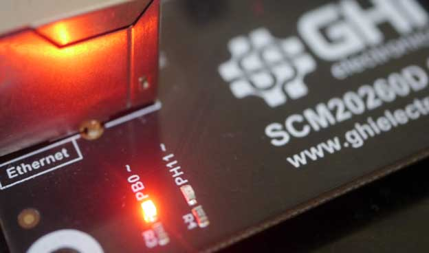

# PC Data Transfer
---
These protocols facilitate communication between the SITCore device and a PC. The [USB](usb.md) page has more details and is a prerequisite to this tutorial.

## USB CDC
The USB Communications Device Class (CDC) is natively supported by Windows and Linux. It is a way for a PC to use a USB port as a virtual serial port. Once loaded, the PC will use this port like any other serial port (COM port). Windows 10 works without the need for any drivers, but earlier operating systems may need a driver. While it works with most operating systems, CDC is typically limited to 64 KBytes/second.

> [!TIP]
> Needed NuGets: GHIElectronics.TinyCLR.Devices.UsbClient

```cs
var usbclientController = UsbClientController.GetDefault();
    
var usbClientSetting = new UsbClientSetting(){
        Mode = UsbClientMode.Cdc,
        ManufactureName = "Manufacture_Name",
        ProductName = "Product_Name",
        SerialNumber = "12345678",            
};

var cdc = new Cdc(usbclientController, usbClientSetting);

cdc.DeviceStateChanged += (a,b) => Debug.WriteLine("Connection changed."); 
cdc.DataReceived += (a,count) => Debug.WriteLine("Data received:" + count);

cdc.Enable();


while (cdc.DeviceState != DeviceState.Configured);
        Debug.WriteLine("UsbClient Connected");

// The example will read data from port to dataR array
// Copy dataR to dataW array, plus 1 for each element
// Write dataW array back to port

while (true){
    var len = cdc.Stream.ByteToRead;

    if (len > 0){
        var dataR = new byte[len];
        var dataW = new byte[len];
        int read = cdc.Stream.Read(dataR);

        for (var i = 0; i < read; i++){
            dataW[i] = (byte)(dataR[i] + 1);
        }
        cdc.Stream.Write(dataW);
    }
    Thread.Sleep(100);
}

```

---

## WinUSB
The WinUSB drivers are unique to Windows and take advantage of the power and speed of USB to provide faster communication than CDC. The speed is limited by the data processing on the IoT device. Windows 10 loads the drivers automatically, Windows 7 requires drivers.

> [!NOTE]
> Unlike CDC mode, a disadvantage of WinUSB is that it requires a special code on the PC side to read and write to the device.

```cs
var usbclientController = UsbClientController.GetDefault();
    
var usbClientSetting = new UsbClientSetting(){
    Mode = UsbClientMode.WinUsb,
    ManufactureName = "Manufacture_Name",
    ProductName = "Product_Name",
    SerialNumber = "12345678",
    Guid = "{your guid}",
};

var winUsb = new WinUsb(usbclientController, usbClientSetting);

winUsb.DeviceStateChanged += (a,b) => Debug.WriteLine("Connection changed."); 
winUsb.DataReceived += (a,count) => Debug.WriteLine("Data received:" + count);
                 
winUsb.Enable();


while (winUsb.DeviceState != DeviceState.Configured) ;
        Debug.WriteLine("UsbClient Connected");

// The example will read data from port to dataR array
// Copy dataR to dataW array, plus 1 for each element
// Write dataW array back to port
    
while (true){
    var len = winUsb.Stream.ByteToRead;

    if (len > 0){
        var dataR = new byte[len];
        var dataW = new byte[len];
        int read = winUsb.Stream.Read(dataR);

        for (var i = 0; i < read; i++){
            dataW[i] = (byte)(dataR[i] + 1);
        }
        winUsb.Stream.Write(dataW);
    }
    Thread.Sleep(100);
}
```
## WebUSB
Some modern browsers, like Chrome and Edge, include a way to give access to the USB from the web content. TinyCLR CDC and WinUSB already include the necessary descriptors to enable WebUSB. This [repo]( https://github.com/ghi-electronics/TinyCLR-WebUSB) includes a full `WebUSBApp` example to load onto the device, that is any TinyCLR device. Once loaded, visit https://ghi-electronics.github.io/TinyCLR-WebUSB/ to connect to the device.


User will see `TinyCLR WebUsb` device as an option to `Connect`


On successful connection the input drop downs are enabled. 


After selecting `Update State` the device sends back a message indicating the outcome. 


In this case the `PB0` is set `HIGH` and the LED turns on.



The secret sauce is in using the correct endpoints, which are fixed in both CDC and WinUSB drivers. This line can be used to initiate the class `let webusb = new WebUSB(2, 1);` which is found inside `webusb.js` file


