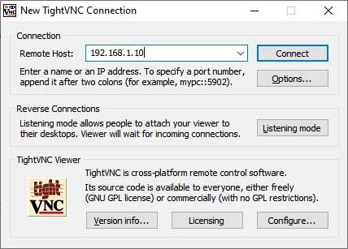
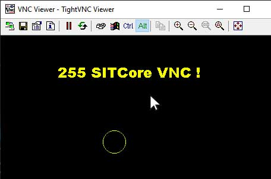
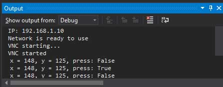

# VNC (Virtual Network Computing)
---
Users can use a VNC viewer to remotely view and control SITCore hardware from a PC, Phone or Tablet. Tested and compatible with the following VNC viewers:

1. TightVNC Viewer 2.8.27
2. TightVNC Java Viewer 2.8.3
3. UltraVNC 1.2.4.0
4. bVNC: Secure VNC Viewer APP

>[!TIP]
> RealVNC is not supported.

The only requirement to connect is the IP address of the Remote Host (SITCore device).



The Preferred encoding format should be set to Raw.


From here, the TinyCLR `Graphics` will appear in the VNC client window. 



Additionally, the `VncServer` receives Mouse coordinates & click status from the VNC client and are returned in the `PointerChangedEvent`.



>[!TIP]
>Needed NuGets: GHIElectronics.TinyCLR.Vnc;

```cs
static VncServer vncServer;

static void Main(){
// To do: Setup the preferred network connection here
// ...
    
// Start VNC 
vncServer = new VncServer("VNC Viewer", 5900, 320, 240);
vncServer.PointerChangedEvent += S_PointerChangedEvent;
vncServer.Start();
Debug.WriteLine("VNC started");
    
// Start Drawing!
Graphics vncDisplay = Graphics.FromImage(new Bitmap(320, 240));
var font = Resources.GetFont(Resources.FontResources.Arial);
var cnt = 0;

Graphics.OnFlushEvent += Graphics_OnFlushEvent;

    while (true) {
        vncDisplay.Clear();
        vncDisplay.DrawString(cnt + " SITCore VNC ! ", font, new SolidBrush(Color.Yellow), 15, 20);
        vncDisplay.DrawEllipse(new Pen(Color.Red), cnt, 160, 40, 40);

        vncDisplay.Flush();
        if ((cnt += 5) > 320) {
            cnt = 0;
            vncDisplay.Clear();
        }        
        Thread.Sleep(10);
    }
}

private static void S_PointerChangedEvent(int x, int y, bool pressed) {
    Debug.WriteLine("x = " + x + ", y = " + y + ", press: " + pressed);
}

private static void Graphics_OnFlushEvent(Graphics sender, byte[] data, int x, int y, int width, int height, int originalWidth) {
        vncServer.Send(data, x, y, width, height);
}
```

